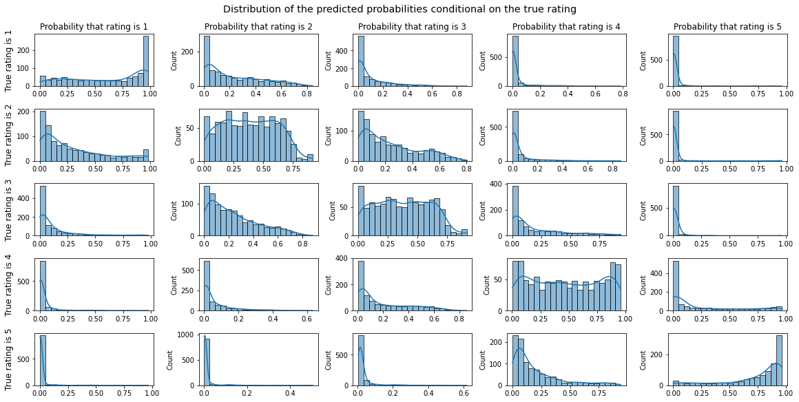
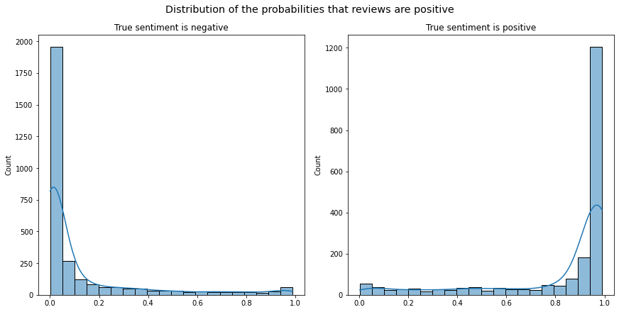
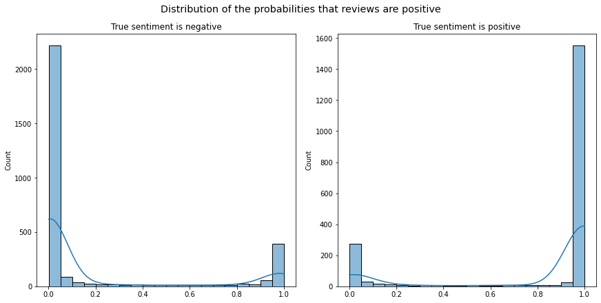
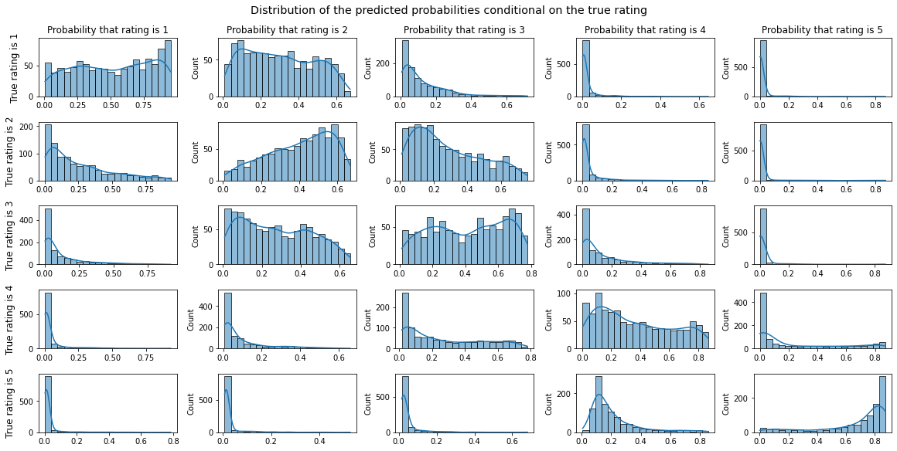
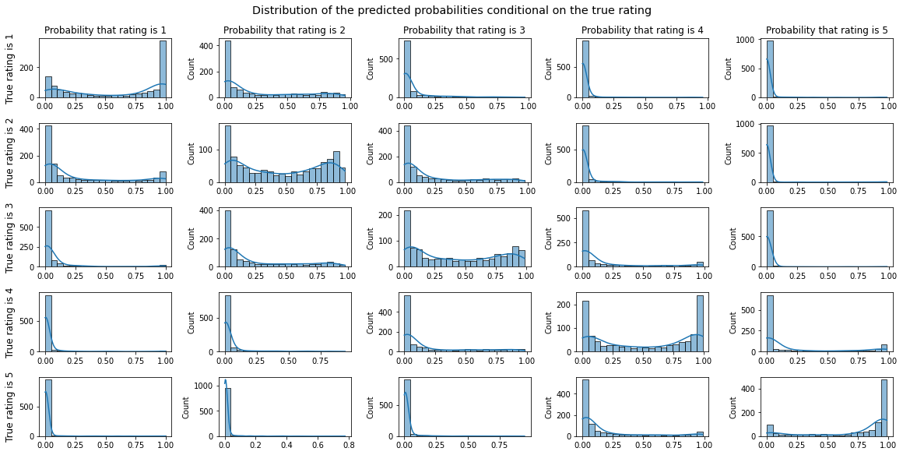
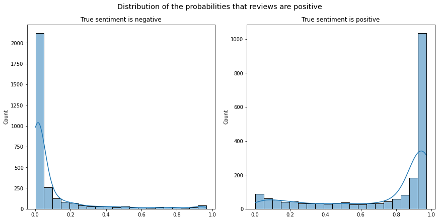
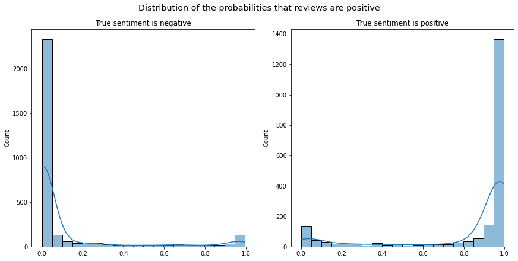

In a previous notebook we compared the performance of two methods to classify podcast reviews by sentiment. The VADER polarity score and a distilBERT transformer fine-tuned on the SST2 dataset, which consists of sentences from movie reviews.

In this notebook we will use the **Hugging Face** API and **PyTorch** to fine-tune the base **distilBERT** on the podcast reviews. We will train it to predict the rating given the title and body of the review. By converting the rating to sentiment, this also gives us a sentiment classifier.

Once we have trained our model, we will compare its performance with the "ready to use" model trained on SST2. Specifically we will compute accuracy and recall, and also visualize the distributions of predicted probabilities.

By base distilBERT we mean the model that has been pretrained only on two general language tasks (as opposed to sentiment analysis): predicting masked words in a sentence and predicting whether two sentences are adjacent. (Additionally the outputs of the BERT model from which it is *distilled* are used but we won't go into the details of knowledge distillation). Fine-tuning distilBERT for sentiment classification consists of adding a classification layer at the end of the transformer and then training this slightly modified transformer for sentiment classification (with a small learning rate). This is called **transfer learning**.

As part of the training process we will use **Ray Tune** to find good **hyperparameters**.

Finally, we will compare the predictions of our model with the model trained on SST2 on some reviews we will "hold out" of the training set. We picked those reviews because VADER was having a particularly hard time with them and they seemed interesting examples to test what the models have learned about podcast reviews.

**Summary of results:**
- Training distilBERT for about two epochs on 80,000 podcast reviews results in a sentiment prediction accuracy of $0.883$ on a test set of 5000 reviews. The accuracy of the distilBERT fine-tuned on SST2 on the same test set is $0.815$. The training, evaluation and test sets were constructed in such a way that all ratings are represented equally.
- Comparing the two models on some interesting reviews held out of the training set, it appears that our model learned to classify some difficult cases which are particular to the context of podcast reviews. For example, reviews of horror themed podcasts use language that would be indicative of negative sentiment in other contexts but are actually expressing approval of the show in this context.
- We measured model learning beyond the accuracy and training/evaluation loss: One observation is that the recall for positive and negative reviews gets more balanced over time, even as the accuracy and loss plateau. Another aspect we note is that the model gets more confident over time, i.e. distribution of output probabilities became more and more concentrated. This is a symptom of overfitting.

## 1. Data Cleaning
In a previous notebook we processed the reviews data but it is still a noisy dataset! We will do the following:
- Some reviews appear to be **spam**, which is why we will remove reviews by users with suspiciously high review counts.
- We will also exclude **some podcasts for kids** because a majority of the reviews for those podcasts aren't really reviews. Instead, children appear to be using the reviews as a forum in which to post jokes.
- Finally, will remove **repeat reviews** (reviews from the same user for the same podcast) to make sure there is no data leakage from the test set to the training set. I'm not sure why there are repeat reviews but I suspect that they are edited reviews. The reason we need to exclude them is that the review content is often very similar and the rating is usually the same.

**Special holdout dataset**: As mentioned, we will exclude a couple of reviews (on which we want to evaluate the models at the end) from the training set to make sure they haven't been memorized by the model (their indices are in `holdout_ids`). This is separate from the evaluation and test sets and not intended to be statistically significant, just to illustrate what the model has learned.

```python
reviews_raw = pd.read_pickle(os.path.join(PATH, 'data/reviews_raw_sentiment.pkl'))
```

```python
def remove_spammers(reviews, max_reviews=135):
    'Remove users with suspiciously high review count.'
    mask = reviews.groupby('user_id')['podcast_id'].transform('count') <= max_reviews
    return reviews[mask]

def keep_only_latest_rating(ratings):
    'Remove repeat reviews, keeping the latest. Also sorts the ratings by date.'
    return ratings.sort_values(by='created_at', ascending=False).drop_duplicates(subset=['podcast_id', 'user_id'])
```

```python
holdout_ids = = [956562, 49428, 15130, 212768, 123052, 283, 973, 1516, 2566, 14947, 922494, 9, 10, 76, 11204, 11211, 48339]
kids_podcasts = ['Wow in the World', 'Story Pirates', 'Pants on Fire', 'The Official Average Boy Podcast', 'Despicable Me', 'Rebel Girls', 'Fierce Girls', 'Like and Subscribe: A podcast about YouTube culture', 'The Casagrandes Familia Sounds', 'What If World - Stories for Kids', 'Good Night Stories for Rebel Girls', 'Gird Up! Podcast', 'Highlights Hangout', 'Be Calm on Ahway Island Bedtime Stories', 'Smash Boom Best', 'The Cramazingly Incredifun Sugarcrash Kids Podcast']
```

```python
reviews = (
  reviews_raw.query('name not in @kids_podcasts')
             .query('index not in @holdout_ids')
             .pipe(remove_spammers)
             .pipe(keep_only_latest_rating)
)
```

The classifier will expect the labels (targets) to start at 0, which is why we need to create a labels column which shifts the ratings by one.

```python
reviews['labels'] = reviews['rating'] - 1
```

Now we create **validation** and **test** sets, in such a way that they both have around 1000 reviews for each star rating (**uniform distribution of star ratings**). We do this to ensure that the accuracy metric treats all star ratings equally.

```python
reviews_val_test = (
    reviews.groupby('labels')
           .sample(n=2000)
)

reviews_train = reviews.query('index not in @reviews_val_test.index')
reviews_val, reviews_test = train_test_split(reviews_val_test, test_size=0.5)
```

```python
reviews_val['labels'].value_counts()
```

    2    1013
    4    1011
    1    1007
    3     989
    0     980
    Name: labels, dtype: int64

```python
reviews_test['labels'].value_counts()
```

    0    1020
    3    1011
    1     993
    4     989
    2     987
    Name: labels, dtype: int64

```python
reviews_train['labels'].value_counts()
```

    4    811106
    0     43229
    3     26008
    2     19150
    1     17149
    Name: labels, dtype: int64

The data has a very high skew towards 5 star ratings. We will create a **training set which contains the same amount of reviews for each rating value**, to make sure the model treats each rating class equally, so to speak. We did the same for the evaluation and test splits.

```python
reviews_train_equal = (
  reviews_train.groupby('labels')
               .sample(n=16_000)
               .sample(frac=1) #shuffle rows
)
```

Now we **pickle** the train, evaluation and test sets to **ensure reproducibility**. We took care to set seeds for NumPy and PyTorch at the beginning of the notebook but it is best to be careful, particularly in a notebook were cells could be run multiple times or out of order.

```python
reviews_train_equal.to_pickle(os.path.join(PATH, 'data/reviews_train_equal.pkl'))
reviews_val.to_pickle(os.path.join(PATH, 'data/reviews_val.pkl'))
reviews_test.to_pickle(os.path.join(PATH, 'data/reviews_test.pkl'))
```

```python
reviews_train_equal = pd.read_pickle(os.path.join(PATH, 'data/reviews_train_equal.pkl'))
reviews_val = pd.read_pickle(os.path.join(PATH, 'data/reviews_val.pkl'))
reviews_test = pd.read_pickle(os.path.join(PATH, 'data/reviews_test.pkl'))
```

```python
reviews_train_equal['labels'].value_counts()
```

    4    16000
    0    16000
    1    16000
    3    16000
    2    16000
    Name: labels, dtype: int64

Now we tokenize the datasets, which needs to be done before we feed them to the model. We saw in the previous notebook that under $3\%$ of reviews result in sequences of more than 256 tokens, which is why we set that as the `max_length`.

```python
train_dataset_equal = Dataset.from_dict(reviews_train_equal[['demojized review', 'labels']])
val_dataset = Dataset.from_dict(reviews_val[['demojized review', 'labels']])
# We omit 'labels' in the test_dataset because otherwise we would get an error
# when evaluating the model fine tuned on SST2 with only 2 labels, instead of 5
test_dataset = Dataset.from_dict(reviews_test[['demojized review']])
dataset_dict = DatasetDict({'train_equal':train_dataset_equal, 'validation':val_dataset, 'test':test_dataset})
```

```python
tokenizer = AutoTokenizer.from_pretrained(PRETRAINED)
```

```python
def tokenize_function(data, tokenizer, truncation=True, max_length=256):
    return tokenizer(data['demojized review'], truncation=truncation, max_length=max_length)
```

```python
tokenized_datasets = (
    dataset_dict.map(partial(tokenize_function, tokenizer=tokenizer), batched=True)
                .remove_columns(['demojized review'])
)

tokenized_datasets.set_format('torch')
```

## 2. Hyperparameter Search

Now we are ready to do the hyperparameter search using Hugging Face and Ray Tune. We will perform a random search over the batch sizes 8, 16 and 32, as well as learning rates between $10^{-5}$ and $10^{-4}$. This roughly agrees with the recommended parameters in the original [paper](https://arxiv.org/pdf/1810.04805.pdf) (Appendix A.3). They also recommend the epoch numbers 2, 3 and 4 but we will only use 2 epochs because that takes a long time already (and many Colab compute units 😬).

We also use an ASHA scheduler to terminate less promising trials, although in retrospect I'm not sure that is a good idea (see below). That said, with the scheduler it already took me 3 hours with a "premium GPU" on Colab and from the results it looks like the hyperparameter choice does not make a big difference (within a reasonable range).

The following function will evaluate the model during the training. It computes the accuracy and the recall. The recall is computed for every rating class and thus consists of 5 numbers.

```python
def compute_metrics(eval_preds):
  logits, labels = eval_preds
  predictions = np.argmax(logits, axis=-1)
  accuracy = accuracy_score(labels, predictions)
  recall = recall_score(
      y_true=labels,
      y_pred=predictions,
      labels=[0, 1, 2, 3, 4], 
      average=None,
  )
  metric_names = [f'recall_{n}_stars' for n in range(1, 6)] + ['accuracy']
  return dict(zip(metric_names, list(recall) + [accuracy]))
```

```python
training_args = TrainingArguments(
    output_dir='hugging-face-trainers',
    num_train_epochs=2,
    eval_steps=500,
    evaluation_strategy='steps',
    save_strategy='no',
    disable_tqdm=True,
)

def get_model():
  return AutoModelForSequenceClassification.from_pretrained(
      'distilbert-base-uncased',
      num_labels=5,
      ignore_mismatched_sizes=True,
)

trainer = Trainer(
    model=None,
    model_init=get_model,
    args=training_args,
    train_dataset=tokenized_datasets['train_equal'],
    eval_dataset=tokenized_datasets['validation'],
    tokenizer=tokenizer,
    compute_metrics=compute_metrics,
)

scheduler = ASHAScheduler(
        metric="eval_accuracy",
        mode="max",
        grace_period=4,
        reduction_factor=4,
)

def hp_space(trial):
  return {
      'learning_rate': tune.loguniform(1e-5, 1e-4),
      'per_device_train_batch_size': tune.choice([8, 16, 32]),
  }

reporter = JupyterNotebookReporter(
    parameter_columns={
        'learning_rate': 'lr',
        'per_device_train_batch_size': 'train_bs/gpu',
    },
    metric_columns=[
        'eval_accuracy', 'eval_loss', 'epoch',
        'eval_recall_1_stars', 'eval_recall_2_stars', 'eval_recall_3_stars',
        'eval_recall_4_stars', 'eval_recall_5_stars'
    ]
)
```

```python
best_run = trainer.hyperparameter_search(
    hp_space=hp_space,
    backend='ray',
    direction='maximize',
    n_trials=15,
    resources_per_trial={
        'cpu': 1,
        'gpu': 1/3,
    },
    scheduler=scheduler,
    checkpoint_score_attr='training_iteration',
    progress_reporter=reporter,
    local_dir=os.path.join(PATH, 'models'),
    name='hp_search_5class_uniform_ratings',
    log_to_file=True,
)
```

== Status ==<br>Current time: 2022-10-18 15:20:26 (running for 02:04:20.59)<br>Memory usage on this node: 9.4/83.5 GiB<br>Using AsyncHyperBand: num_stopped=9
Bracket: Iter 64.000: None | Iter 16.000: 0.5892 | Iter 4.000: 0.5764<br>Resources requested: 0/12 CPUs, 0/1 GPUs, 0.0/49.81 GiB heap, 0.0/24.91 GiB objects<br>Result logdir: /content/drive/MyDrive/ml-projects/podcast-reviews/models/hp_search_5class_uniform_ratings<br>Number of trials: 15/15 (15 TERMINATED)<br><table>
<thead>
<tr><th>Trial name            </th><th>status    </th><th>loc            </th><th style="text-align: right;">         lr</th><th style="text-align: right;">  train_bs/gpu</th><th>lr_scheduler  </th><th style="text-align: right;">  eval_accuracy</th><th style="text-align: right;">  eval_loss</th><th style="text-align: right;">  epoch</th><th style="text-align: right;">  eval_recall_1_stars</th><th style="text-align: right;">  eval_recall_2_stars</th><th style="text-align: right;">  eval_recall_3_stars</th><th style="text-align: right;">  eval_recall_4_stars</th><th style="text-align: right;">  eval_recall_5_stars</th></tr>
</thead>
<tbody>
<tr><td>_objective_0585f_00000</td><td>TERMINATED</td><td>172.28.0.2:907 </td><td style="text-align: right;">2.36886e-05</td><td style="text-align: right;">             8</td><td>              </td><td style="text-align: right;">         0.5982</td><td style="text-align: right;">   0.972204</td><td style="text-align: right;">    2  </td><td style="text-align: right;">             0.615306</td><td style="text-align: right;">             0.480636</td><td style="text-align: right;">             0.499506</td><td style="text-align: right;">             0.579373</td><td style="text-align: right;">             0.816024</td></tr>
<tr><td>_objective_0585f_00001</td><td>TERMINATED</td><td>172.28.0.2:947 </td><td style="text-align: right;">6.02131e-05</td><td style="text-align: right;">             8</td><td>              </td><td style="text-align: right;">         0.5778</td><td style="text-align: right;">   0.992277</td><td style="text-align: right;">    0.8</td><td style="text-align: right;">             0.646939</td><td style="text-align: right;">             0.409136</td><td style="text-align: right;">             0.456071</td><td style="text-align: right;">             0.521739</td><td style="text-align: right;">             0.855589</td></tr>
<tr><td>_objective_0585f_00002</td><td>TERMINATED</td><td>172.28.0.2:949 </td><td style="text-align: right;">1.43217e-05</td><td style="text-align: right;">            32</td><td>              </td><td style="text-align: right;">         0.5962</td><td style="text-align: right;">   0.967467</td><td style="text-align: right;">    2  </td><td style="text-align: right;">             0.639796</td><td style="text-align: right;">             0.46574 </td><td style="text-align: right;">             0.467917</td><td style="text-align: right;">             0.55814 </td><td style="text-align: right;">             0.849654</td></tr>
<tr><td>_objective_0585f_00003</td><td>TERMINATED</td><td>172.28.0.2:1774</td><td style="text-align: right;">2.1563e-05 </td><td style="text-align: right;">            32</td><td>              </td><td style="text-align: right;">         0.597 </td><td style="text-align: right;">   0.961714</td><td style="text-align: right;">    2  </td><td style="text-align: right;">             0.633673</td><td style="text-align: right;">             0.474677</td><td style="text-align: right;">             0.471866</td><td style="text-align: right;">             0.564206</td><td style="text-align: right;">             0.840752</td></tr>
<tr><td>_objective_0585f_00004</td><td>TERMINATED</td><td>172.28.0.2:2334</td><td style="text-align: right;">9.33061e-05</td><td style="text-align: right;">            16</td><td>              </td><td style="text-align: right;">         0.539 </td><td style="text-align: right;">   1.06329 </td><td style="text-align: right;">    0.4</td><td style="text-align: right;">             0.346939</td><td style="text-align: right;">             0.481629</td><td style="text-align: right;">             0.563672</td><td style="text-align: right;">             0.408493</td><td style="text-align: right;">             0.885262</td></tr>
<tr><td>_objective_0585f_00005</td><td>TERMINATED</td><td>172.28.0.2:2670</td><td style="text-align: right;">1.51993e-05</td><td style="text-align: right;">             8</td><td>              </td><td style="text-align: right;">         0.543 </td><td style="text-align: right;">   1.06707 </td><td style="text-align: right;">    0.2</td><td style="text-align: right;">             0.517347</td><td style="text-align: right;">             0.543198</td><td style="text-align: right;">             0.479763</td><td style="text-align: right;">             0.471183</td><td style="text-align: right;">             0.701286</td></tr>
<tr><td>_objective_0585f_00006</td><td>TERMINATED</td><td>172.28.0.2:2895</td><td style="text-align: right;">4.08934e-05</td><td style="text-align: right;">             8</td><td>              </td><td style="text-align: right;">         0.5496</td><td style="text-align: right;">   1.05635 </td><td style="text-align: right;">    0.2</td><td style="text-align: right;">             0.577551</td><td style="text-align: right;">             0.474677</td><td style="text-align: right;">             0.454097</td><td style="text-align: right;">             0.569262</td><td style="text-align: right;">             0.673591</td></tr>
<tr><td>_objective_0585f_00007</td><td>TERMINATED</td><td>172.28.0.2:3032</td><td style="text-align: right;">1.95537e-05</td><td style="text-align: right;">            32</td><td>              </td><td style="text-align: right;">         0.597 </td><td style="text-align: right;">   0.962354</td><td style="text-align: right;">    2  </td><td style="text-align: right;">             0.635714</td><td style="text-align: right;">             0.473684</td><td style="text-align: right;">             0.46693 </td><td style="text-align: right;">             0.564206</td><td style="text-align: right;">             0.844708</td></tr>
<tr><td>_objective_0585f_00008</td><td>TERMINATED</td><td>172.28.0.2:3170</td><td style="text-align: right;">1.11344e-05</td><td style="text-align: right;">            32</td><td>              </td><td style="text-align: right;">         0.5756</td><td style="text-align: right;">   1.00606 </td><td style="text-align: right;">    0.8</td><td style="text-align: right;">             0.694898</td><td style="text-align: right;">             0.457795</td><td style="text-align: right;">             0.378085</td><td style="text-align: right;">             0.465116</td><td style="text-align: right;">             0.883284</td></tr>
<tr><td>_objective_0585f_00009</td><td>TERMINATED</td><td>172.28.0.2:3273</td><td style="text-align: right;">6.09784e-05</td><td style="text-align: right;">            32</td><td>              </td><td style="text-align: right;">         0.5948</td><td style="text-align: right;">   0.974191</td><td style="text-align: right;">    2  </td><td style="text-align: right;">             0.614286</td><td style="text-align: right;">             0.46574 </td><td style="text-align: right;">             0.501481</td><td style="text-align: right;">             0.57634 </td><td style="text-align: right;">             0.816024</td></tr>
<tr><td>_objective_0585f_00010</td><td>TERMINATED</td><td>172.28.0.2:3751</td><td style="text-align: right;">9.62124e-05</td><td style="text-align: right;">             8</td><td>              </td><td style="text-align: right;">         0.5222</td><td style="text-align: right;">   1.10365 </td><td style="text-align: right;">    0.2</td><td style="text-align: right;">             0.67449 </td><td style="text-align: right;">             0.288977</td><td style="text-align: right;">             0.455084</td><td style="text-align: right;">             0.488372</td><td style="text-align: right;">             0.707221</td></tr>
<tr><td>_objective_0585f_00011</td><td>TERMINATED</td><td>172.28.0.2:3914</td><td style="text-align: right;">4.05084e-05</td><td style="text-align: right;">             8</td><td>              </td><td style="text-align: right;">         0.556 </td><td style="text-align: right;">   1.058   </td><td style="text-align: right;">    0.2</td><td style="text-align: right;">             0.610204</td><td style="text-align: right;">             0.447865</td><td style="text-align: right;">             0.479763</td><td style="text-align: right;">             0.538928</td><td style="text-align: right;">             0.704253</td></tr>
<tr><td>_objective_0585f_00012</td><td>TERMINATED</td><td>172.28.0.2:4076</td><td style="text-align: right;">1.03101e-05</td><td style="text-align: right;">             8</td><td>              </td><td style="text-align: right;">         0.5434</td><td style="text-align: right;">   1.0641  </td><td style="text-align: right;">    0.2</td><td style="text-align: right;">             0.516327</td><td style="text-align: right;">             0.529295</td><td style="text-align: right;">             0.481737</td><td style="text-align: right;">             0.462083</td><td style="text-align: right;">             0.725025</td></tr>
<tr><td>_objective_0585f_00013</td><td>TERMINATED</td><td>172.28.0.2:4261</td><td style="text-align: right;">6.43276e-05</td><td style="text-align: right;">             8</td><td>              </td><td style="text-align: right;">         0.5432</td><td style="text-align: right;">   1.07166 </td><td style="text-align: right;">    0.2</td><td style="text-align: right;">             0.697959</td><td style="text-align: right;">             0.351539</td><td style="text-align: right;">             0.465943</td><td style="text-align: right;">             0.497472</td><td style="text-align: right;">             0.706231</td></tr>
<tr><td>_objective_0585f_00014</td><td>TERMINATED</td><td>172.28.0.2:4370</td><td style="text-align: right;">1.70174e-05</td><td style="text-align: right;">            32</td><td>              </td><td style="text-align: right;">         0.5968</td><td style="text-align: right;">   0.964603</td><td style="text-align: right;">    2  </td><td style="text-align: right;">             0.637755</td><td style="text-align: right;">             0.471698</td><td style="text-align: right;">             0.46693 </td><td style="text-align: right;">             0.560162</td><td style="text-align: right;">             0.847676</td></tr>
</tbody>
</table><br><br>

    2022-10-18 15:20:26,481	INFO tune.py:759 -- Total run time: 7461.08 seconds (7460.56 seconds for the tuning loop).

```python
best_run
```

    BestRun(run_id='0585f_00000', objective=3.5890449331933936, hyperparameters={'learning_rate': 2.368863950364079e-05, 'per_device_train_batch_size': 8})

It seems that with higher batch size the accuracy is often better but at the cost of having higher recall for 1 and 5 stars and worse recall for the intermediate ratings. However, this might be an artifact of the ASHA early stopping, which appears to favor the larger batch sizes. This is probably because they converge more quickly at first given that the model gets to "see" more examples at each step. What makes me think this is indeed the case is: 1) all the completed trials except one have batch size 32 2) the only smaller batch trial that wasn't stopped early ended up having the highest accuracy (it was also the first trial and thus not subject to being stopped early).

In any case, the differences in accuracy are very small and it's not worth it to repeat the costly hyperparameter search.

## 3. Fine-Tuning distilBERT

We will use the best parameters we found above: batch size 8 and learning rate $2.44\cdot10^{-5}$. Note that because we will train with 4 epochs instead of the 2 epochs we used in the hyperparameter search, the learning rate will actually be s little higher for longer at the beginning, given that we are using a linear learning rate scheduler (the default).

```python
base_model = AutoModelForSequenceClassification.from_pretrained(
      PRETRAINED,
      num_labels=5,
      ignore_mismatched_sizes=True,
)
```

```python
training_args = TrainingArguments(
    output_dir=os.path.join(PATH, 'models/best-run'),
    learning_rate=2.4e-5,
    per_device_train_batch_size=8,
    per_device_eval_batch_size=32,
    num_train_epochs=4,
    evaluation_strategy='steps',
)

trainer = Trainer(
    model=base_model,
    args=training_args,
    train_dataset=tokenized_datasets['train_equal'],
    eval_dataset=tokenized_datasets['validation'],
    tokenizer=tokenizer,
    compute_metrics=compute_metrics,
)

trainer.train()
```

    using `logging_steps` to initialize `eval_steps` to 500
    PyTorch: setting up devices
    The default value for the training argument `--report_to` will change in v5 (from all installed integrations to none). In v5, you will need to use `--report_to all` to get the same behavior as now. You should start updating your code and make this info disappear :-).
    /usr/local/lib/python3.7/dist-packages/transformers/optimization.py:310: FutureWarning: This implementation of AdamW is deprecated and will be removed in a future version. Use the PyTorch implementation torch.optim.AdamW instead, or set `no_deprecation_warning=True` to disable this warning
      FutureWarning,
    ***** Running training *****
      Num examples = 80000
      Num Epochs = 4
      Instantaneous batch size per device = 8
      Total train batch size (w. parallel, distributed & accumulation) = 8
      Gradient Accumulation steps = 1
      Total optimization steps = 40000

    <div>

      <progress value='40000' max='40000' style='width:300px; height:20px; vertical-align: middle;'></progress>
      [40000/40000 2:22:31, Epoch 4/4]
    </div>
    <table class="dataframe">
  <thead>
 <tr style="text-align: left;">
      <th>Step</th>
      <th>Training Loss</th>
      <th>Validation Loss</th>
      <th>Recall 1 Stars</th>
      <th>Recall 2 Stars</th>
      <th>Recall 3 Stars</th>
      <th>Recall 4 Stars</th>
      <th>Recall 5 Stars</th>
      <th>Accuracy</th>
    </tr>
  </thead>
  <tbody>
    <tr>
      <td>500</td>
      <td>1.245400</td>
      <td>1.128538</td>
      <td>0.621429</td>
      <td>0.371400</td>
      <td>0.318855</td>
      <td>0.506572</td>
      <td>0.841741</td>
      <td>0.531600</td>
    </tr>
    <tr>
      <td>1000</td>
      <td>1.093900</td>
      <td>1.104158</td>
      <td>0.355102</td>
      <td>0.348560</td>
      <td>0.655479</td>
      <td>0.425683</td>
      <td>0.782394</td>
      <td>0.515000</td>
    </tr>
    <tr>
      <td>1500</td>
      <td>1.078600</td>
      <td>1.058309</td>
      <td>0.416327</td>
      <td>0.629593</td>
      <td>0.319842</td>
      <td>0.556117</td>
      <td>0.807122</td>
      <td>0.546400</td>
    </tr>
    <tr>
      <td>2000</td>
      <td>1.059700</td>
      <td>1.082167</td>
      <td>0.811224</td>
      <td>0.345581</td>
      <td>0.339585</td>
      <td>0.427705</td>
      <td>0.801187</td>
      <td>0.544000</td>
    </tr>
    <tr>
      <td>2500</td>
      <td>1.051500</td>
      <td>1.042632</td>
      <td>0.665306</td>
      <td>0.434955</td>
      <td>0.320829</td>
      <td>0.562184</td>
      <td>0.812067</td>
      <td>0.558400</td>
    </tr>
    <tr>
      <td>3000</td>
      <td>1.033800</td>
      <td>1.027814</td>
      <td>0.750000</td>
      <td>0.400199</td>
      <td>0.388944</td>
      <td>0.485339</td>
      <td>0.791296</td>
      <td>0.562400</td>
    </tr>
    <tr>
      <td>3500</td>
      <td>1.048100</td>
      <td>1.018655</td>
      <td>0.706122</td>
      <td>0.328699</td>
      <td>0.543929</td>
      <td>0.564206</td>
      <td>0.717112</td>
      <td>0.571400</td>
    </tr>
    <tr>
      <td>4000</td>
      <td>1.009200</td>
      <td>1.007908</td>
      <td>0.629592</td>
      <td>0.470705</td>
      <td>0.384995</td>
      <td>0.577351</td>
      <td>0.802176</td>
      <td>0.572600</td>
    </tr>
    <tr>
      <td>4500</td>
      <td>1.027100</td>
      <td>1.057035</td>
      <td>0.359184</td>
      <td>0.422046</td>
      <td>0.571570</td>
      <td>0.593529</td>
      <td>0.796241</td>
      <td>0.549600</td>
    </tr>
    <tr>
      <td>5000</td>
      <td>0.993200</td>
      <td>1.007861</td>
      <td>0.609184</td>
      <td>0.384310</td>
      <td>0.527147</td>
      <td>0.549039</td>
      <td>0.818002</td>
      <td>0.577600</td>
    </tr>
    <tr>
      <td>5500</td>
      <td>1.004700</td>
      <td>1.021505</td>
      <td>0.647959</td>
      <td>0.555114</td>
      <td>0.429418</td>
      <td>0.412538</td>
      <td>0.809100</td>
      <td>0.571000</td>
    </tr>
    <tr>
      <td>6000</td>
      <td>1.016400</td>
      <td>0.996876</td>
      <td>0.578571</td>
      <td>0.509434</td>
      <td>0.529121</td>
      <td>0.430738</td>
      <td>0.850643</td>
      <td>0.580400</td>
    </tr>
    <tr>
      <td>6500</td>
      <td>0.990500</td>
      <td>1.001491</td>
      <td>0.620408</td>
      <td>0.606753</td>
      <td>0.366239</td>
      <td>0.529828</td>
      <td>0.786350</td>
      <td>0.581800</td>
    </tr>
    <tr>
      <td>7000</td>
      <td>1.022000</td>
      <td>0.974803</td>
      <td>0.677551</td>
      <td>0.448858</td>
      <td>0.399803</td>
      <td>0.566229</td>
      <td>0.852621</td>
      <td>0.588600</td>
    </tr>
    <tr>
      <td>7500</td>
      <td>0.989900</td>
      <td>0.978257</td>
      <td>0.700000</td>
      <td>0.477656</td>
      <td>0.432379</td>
      <td>0.444894</td>
      <td>0.873393</td>
      <td>0.585600</td>
    </tr>
    <tr>
      <td>8000</td>
      <td>0.971000</td>
      <td>0.997515</td>
      <td>0.747959</td>
      <td>0.423039</td>
      <td>0.385982</td>
      <td>0.419616</td>
      <td>0.881306</td>
      <td>0.571200</td>
    </tr>
    <tr>
      <td>8500</td>
      <td>1.010300</td>
      <td>0.978720</td>
      <td>0.729592</td>
      <td>0.400199</td>
      <td>0.478776</td>
      <td>0.467139</td>
      <td>0.871414</td>
      <td>0.589200</td>
    </tr>
    <tr>
      <td>9000</td>
      <td>0.987800</td>
      <td>0.982950</td>
      <td>0.735714</td>
      <td>0.433962</td>
      <td>0.444225</td>
      <td>0.492417</td>
      <td>0.843719</td>
      <td>0.589600</td>
    </tr>
    <tr>
      <td>9500</td>
      <td>1.009900</td>
      <td>0.971602</td>
      <td>0.758163</td>
      <td>0.390268</td>
      <td>0.434353</td>
      <td>0.566229</td>
      <td>0.837784</td>
      <td>0.596600</td>
    </tr>
    <tr>
      <td>10000</td>
      <td>0.993400</td>
      <td>0.987826</td>
      <td>0.552041</td>
      <td>0.414101</td>
      <td>0.462981</td>
      <td>0.669363</td>
      <td>0.815035</td>
      <td>0.582600</td>
    </tr>
    <tr>
      <td>10500</td>
      <td>0.861500</td>
      <td>1.013859</td>
      <td>0.531633</td>
      <td>0.578947</td>
      <td>0.483712</td>
      <td>0.539939</td>
      <td>0.806133</td>
      <td>0.588600</td>
    </tr>
    <tr>
      <td>11000</td>
      <td>0.885600</td>
      <td>1.003105</td>
      <td>0.734694</td>
      <td>0.397219</td>
      <td>0.482725</td>
      <td>0.486350</td>
      <td>0.863501</td>
      <td>0.592600</td>
    </tr>
    <tr>
      <td>11500</td>
      <td>0.878500</td>
      <td>0.998439</td>
      <td>0.530612</td>
      <td>0.507448</td>
      <td>0.475814</td>
      <td>0.588473</td>
      <td>0.833828</td>
      <td>0.587600</td>
    </tr>
    <tr>
      <td>12000</td>
      <td>0.843300</td>
      <td>0.981679</td>
      <td>0.600000</td>
      <td>0.504469</td>
      <td>0.478776</td>
      <td>0.479272</td>
      <td>0.898121</td>
      <td>0.592600</td>
    </tr>
    <tr>
      <td>12500</td>
      <td>0.872100</td>
      <td>1.021082</td>
      <td>0.726531</td>
      <td>0.443893</td>
      <td>0.365252</td>
      <td>0.553084</td>
      <td>0.855589</td>
      <td>0.588200</td>
    </tr>
    <tr>
      <td>13000</td>
      <td>0.864900</td>
      <td>0.984879</td>
      <td>0.598980</td>
      <td>0.450844</td>
      <td>0.461994</td>
      <td>0.597573</td>
      <td>0.848665</td>
      <td>0.591600</td>
    </tr>
    <tr>
      <td>13500</td>
      <td>0.867700</td>
      <td>0.968538</td>
      <td>0.574490</td>
      <td>0.454816</td>
      <td>0.502468</td>
      <td>0.585440</td>
      <td>0.827893</td>
      <td>0.589200</td>
    </tr>
    <tr>
      <td>14000</td>
      <td>0.865500</td>
      <td>0.996079</td>
      <td>0.586735</td>
      <td>0.510427</td>
      <td>0.527147</td>
      <td>0.442872</td>
      <td>0.883284</td>
      <td>0.590800</td>
    </tr>
    <tr>
      <td>14500</td>
      <td>0.860200</td>
      <td>0.987961</td>
      <td>0.653061</td>
      <td>0.436941</td>
      <td>0.505429</td>
      <td>0.606673</td>
      <td>0.751731</td>
      <td>0.590400</td>
    </tr>
    <tr>
      <td>15000</td>
      <td>0.889400</td>
      <td>0.988690</td>
      <td>0.574490</td>
      <td>0.409136</td>
      <td>0.545903</td>
      <td>0.575329</td>
      <td>0.830861</td>
      <td>0.587400</td>
    </tr>
    <tr>
      <td>15500</td>
      <td>0.851700</td>
      <td>0.996287</td>
      <td>0.610204</td>
      <td>0.478649</td>
      <td>0.463968</td>
      <td>0.569262</td>
      <td>0.826904</td>
      <td>0.589800</td>
    </tr>
    <tr>
      <td>16000</td>
      <td>0.862600</td>
      <td>0.978930</td>
      <td>0.636735</td>
      <td>0.508441</td>
      <td>0.440276</td>
      <td>0.550051</td>
      <td>0.821958</td>
      <td>0.591400</td>
    </tr>
    <tr>
      <td>16500</td>
      <td>0.881000</td>
      <td>0.985724</td>
      <td>0.555102</td>
      <td>0.573982</td>
      <td>0.440276</td>
      <td>0.595551</td>
      <td>0.800198</td>
      <td>0.593200</td>
    </tr>
    <tr>
      <td>17000</td>
      <td>0.838600</td>
      <td>0.989725</td>
      <td>0.674490</td>
      <td>0.440914</td>
      <td>0.502468</td>
      <td>0.550051</td>
      <td>0.829871</td>
      <td>0.599400</td>
    </tr>
    <tr>
      <td>17500</td>
      <td>0.886200</td>
      <td>0.974624</td>
      <td>0.635714</td>
      <td>0.520357</td>
      <td>0.464956</td>
      <td>0.510617</td>
      <td>0.838773</td>
      <td>0.594200</td>
    </tr>
    <tr>
      <td>18000</td>
      <td>0.870900</td>
      <td>0.985520</td>
      <td>0.644898</td>
      <td>0.527309</td>
      <td>0.441264</td>
      <td>0.505561</td>
      <td>0.855589</td>
      <td>0.595000</td>
    </tr>
    <tr>
      <td>18500</td>
      <td>0.873500</td>
      <td>0.990966</td>
      <td>0.595918</td>
      <td>0.451837</td>
      <td>0.438302</td>
      <td>0.644085</td>
      <td>0.818991</td>
      <td>0.589600</td>
    </tr>
    <tr>
      <td>19000</td>
      <td>0.842400</td>
      <td>1.015863</td>
      <td>0.495918</td>
      <td>0.555114</td>
      <td>0.513327</td>
      <td>0.589484</td>
      <td>0.794263</td>
      <td>0.590200</td>
    </tr>
    <tr>
      <td>19500</td>
      <td>0.861000</td>
      <td>0.984092</td>
      <td>0.674490</td>
      <td>0.425025</td>
      <td>0.513327</td>
      <td>0.554095</td>
      <td>0.803165</td>
      <td>0.593800</td>
    </tr>
    <tr>
      <td>20000</td>
      <td>0.853900</td>
      <td>0.994874</td>
      <td>0.670408</td>
      <td>0.511420</td>
      <td>0.443238</td>
      <td>0.526795</td>
      <td>0.800198</td>
      <td>0.590200</td>
    </tr>
    <tr>
      <td>20500</td>
      <td>0.738000</td>
      <td>1.033550</td>
      <td>0.562245</td>
      <td>0.549156</td>
      <td>0.472853</td>
      <td>0.524772</td>
      <td>0.832839</td>
      <td>0.588800</td>
    </tr>
    <tr>
      <td>21000</td>
      <td>0.711800</td>
      <td>1.087762</td>
      <td>0.568367</td>
      <td>0.425025</td>
      <td>0.553801</td>
      <td>0.570273</td>
      <td>0.792285</td>
      <td>0.582200</td>
    </tr>
    <tr>
      <td>21500</td>
      <td>0.723800</td>
      <td>1.099150</td>
      <td>0.552041</td>
      <td>0.448858</td>
      <td>0.510365</td>
      <td>0.652174</td>
      <td>0.767557</td>
      <td>0.586200</td>
    </tr>
    <tr>
      <td>22000</td>
      <td>0.706500</td>
      <td>1.131904</td>
      <td>0.700000</td>
      <td>0.482622</td>
      <td>0.377098</td>
      <td>0.500506</td>
      <td>0.837784</td>
      <td>0.579200</td>
    </tr>
    <tr>
      <td>22500</td>
      <td>0.716100</td>
      <td>1.097652</td>
      <td>0.605102</td>
      <td>0.516385</td>
      <td>0.462981</td>
      <td>0.595551</td>
      <td>0.724036</td>
      <td>0.580600</td>
    </tr>
    <tr>
      <td>23000</td>
      <td>0.711500</td>
      <td>1.042393</td>
      <td>0.619388</td>
      <td>0.471698</td>
      <td>0.512340</td>
      <td>0.521739</td>
      <td>0.841741</td>
      <td>0.593600</td>
    </tr>
    <tr>
      <td>23500</td>
      <td>0.665200</td>
      <td>1.120767</td>
      <td>0.505102</td>
      <td>0.628600</td>
      <td>0.455084</td>
      <td>0.561173</td>
      <td>0.727992</td>
      <td>0.576000</td>
    </tr>
    <tr>
      <td>24000</td>
      <td>0.717600</td>
      <td>1.072822</td>
      <td>0.635714</td>
      <td>0.463754</td>
      <td>0.519250</td>
      <td>0.496461</td>
      <td>0.850643</td>
      <td>0.593400</td>
    </tr>
    <tr>
      <td>24500</td>
      <td>0.701500</td>
      <td>1.091549</td>
      <td>0.598980</td>
      <td>0.554121</td>
      <td>0.446199</td>
      <td>0.525784</td>
      <td>0.790307</td>
      <td>0.583200</td>
    </tr>
    <tr>
      <td>25000</td>
      <td>0.689600</td>
      <td>1.085112</td>
      <td>0.624490</td>
      <td>0.444886</td>
      <td>0.490622</td>
      <td>0.537917</td>
      <td>0.841741</td>
      <td>0.588000</td>
    </tr>
    <tr>
      <td>25500</td>
      <td>0.725500</td>
      <td>1.109724</td>
      <td>0.603061</td>
      <td>0.550149</td>
      <td>0.455084</td>
      <td>0.452983</td>
      <td>0.858556</td>
      <td>0.584400</td>
    </tr>
    <tr>
      <td>26000</td>
      <td>0.695800</td>
      <td>1.102224</td>
      <td>0.591837</td>
      <td>0.508441</td>
      <td>0.501481</td>
      <td>0.507583</td>
      <td>0.830861</td>
      <td>0.588400</td>
    </tr>
    <tr>
      <td>26500</td>
      <td>0.697100</td>
      <td>1.079746</td>
      <td>0.673469</td>
      <td>0.385303</td>
      <td>0.510365</td>
      <td>0.507583</td>
      <td>0.842730</td>
      <td>0.583800</td>
    </tr>
    <tr>
      <td>27000</td>
      <td>0.693500</td>
      <td>1.112715</td>
      <td>0.611224</td>
      <td>0.499503</td>
      <td>0.449161</td>
      <td>0.608696</td>
      <td>0.781405</td>
      <td>0.589800</td>
    </tr>
    <tr>
      <td>27500</td>
      <td>0.700400</td>
      <td>1.105307</td>
      <td>0.632653</td>
      <td>0.447865</td>
      <td>0.479763</td>
      <td>0.563195</td>
      <td>0.826904</td>
      <td>0.590000</td>
    </tr>
    <tr>
      <td>28000</td>
      <td>0.693200</td>
      <td>1.099970</td>
      <td>0.513265</td>
      <td>0.598808</td>
      <td>0.449161</td>
      <td>0.559151</td>
      <td>0.762611</td>
      <td>0.577000</td>
    </tr>
    <tr>
      <td>28500</td>
      <td>0.733600</td>
      <td>1.059791</td>
      <td>0.565306</td>
      <td>0.545184</td>
      <td>0.494571</td>
      <td>0.583418</td>
      <td>0.748764</td>
      <td>0.587600</td>
    </tr>
    <tr>
      <td>29000</td>
      <td>0.697600</td>
      <td>1.076711</td>
      <td>0.546939</td>
      <td>0.530288</td>
      <td>0.489635</td>
      <td>0.589484</td>
      <td>0.776459</td>
      <td>0.586800</td>
    </tr>
    <tr>
      <td>29500</td>
      <td>0.687600</td>
      <td>1.077929</td>
      <td>0.607143</td>
      <td>0.459782</td>
      <td>0.492596</td>
      <td>0.580384</td>
      <td>0.826904</td>
      <td>0.593400</td>
    </tr>
    <tr>
      <td>30000</td>
      <td>0.706100</td>
      <td>1.084087</td>
      <td>0.540816</td>
      <td>0.493545</td>
      <td>0.501481</td>
      <td>0.582406</td>
      <td>0.789318</td>
      <td>0.581800</td>
    </tr>
    <tr>
      <td>30500</td>
      <td>0.542400</td>
      <td>1.207177</td>
      <td>0.639796</td>
      <td>0.460775</td>
      <td>0.473840</td>
      <td>0.546006</td>
      <td>0.796241</td>
      <td>0.583200</td>
    </tr>
    <tr>
      <td>31000</td>
      <td>0.556300</td>
      <td>1.225795</td>
      <td>0.576531</td>
      <td>0.466733</td>
      <td>0.509378</td>
      <td>0.590495</td>
      <td>0.745796</td>
      <td>0.577800</td>
    </tr>
    <tr>
      <td>31500</td>
      <td>0.529400</td>
      <td>1.255818</td>
      <td>0.602041</td>
      <td>0.464747</td>
      <td>0.511352</td>
      <td>0.585440</td>
      <td>0.739862</td>
      <td>0.580600</td>
    </tr>
    <tr>
      <td>32000</td>
      <td>0.553200</td>
      <td>1.246235</td>
      <td>0.583673</td>
      <td>0.493545</td>
      <td>0.481737</td>
      <td>0.544995</td>
      <td>0.784372</td>
      <td>0.577800</td>
    </tr>
    <tr>
      <td>32500</td>
      <td>0.570700</td>
      <td>1.228383</td>
      <td>0.570408</td>
      <td>0.511420</td>
      <td>0.469891</td>
      <td>0.553084</td>
      <td>0.797230</td>
      <td>0.580600</td>
    </tr>
    <tr>
      <td>33000</td>
      <td>0.555200</td>
      <td>1.267651</td>
      <td>0.539796</td>
      <td>0.507448</td>
      <td>0.503455</td>
      <td>0.603640</td>
      <td>0.702275</td>
      <td>0.571400</td>
    </tr>
    <tr>
      <td>33500</td>
      <td>0.552200</td>
      <td>1.268231</td>
      <td>0.623469</td>
      <td>0.435948</td>
      <td>0.476802</td>
      <td>0.563195</td>
      <td>0.789318</td>
      <td>0.577600</td>
    </tr>
    <tr>
      <td>34000</td>
      <td>0.556900</td>
      <td>1.260661</td>
      <td>0.605102</td>
      <td>0.478649</td>
      <td>0.452122</td>
      <td>0.568251</td>
      <td>0.778437</td>
      <td>0.576400</td>
    </tr>
    <tr>
      <td>34500</td>
      <td>0.548100</td>
      <td>1.275731</td>
      <td>0.588776</td>
      <td>0.441907</td>
      <td>0.505429</td>
      <td>0.582406</td>
      <td>0.742829</td>
      <td>0.572200</td>
    </tr>
    <tr>
      <td>35000</td>
      <td>0.576100</td>
      <td>1.266743</td>
      <td>0.590816</td>
      <td>0.474677</td>
      <td>0.477789</td>
      <td>0.577351</td>
      <td>0.763600</td>
      <td>0.576800</td>
    </tr>
    <tr>
      <td>35500</td>
      <td>0.550400</td>
      <td>1.259426</td>
      <td>0.634694</td>
      <td>0.428004</td>
      <td>0.490622</td>
      <td>0.565217</td>
      <td>0.773492</td>
      <td>0.578200</td>
    </tr>
    <tr>
      <td>36000</td>
      <td>0.557200</td>
      <td>1.279438</td>
      <td>0.581633</td>
      <td>0.498510</td>
      <td>0.471866</td>
      <td>0.567240</td>
      <td>0.767557</td>
      <td>0.577400</td>
    </tr>
    <tr>
      <td>36500</td>
      <td>0.546600</td>
      <td>1.275166</td>
      <td>0.579592</td>
      <td>0.485601</td>
      <td>0.480750</td>
      <td>0.565217</td>
      <td>0.787339</td>
      <td>0.579800</td>
    </tr>
    <tr>
      <td>37000</td>
      <td>0.549500</td>
      <td>1.283615</td>
      <td>0.570408</td>
      <td>0.492552</td>
      <td>0.483712</td>
      <td>0.583418</td>
      <td>0.771513</td>
      <td>0.580400</td>
    </tr>
    <tr>
      <td>37500</td>
      <td>0.546800</td>
      <td>1.264037</td>
      <td>0.568367</td>
      <td>0.510427</td>
      <td>0.463968</td>
      <td>0.567240</td>
      <td>0.781405</td>
      <td>0.578400</td>
    </tr>
    <tr>
      <td>38000</td>
      <td>0.526100</td>
      <td>1.276842</td>
      <td>0.621429</td>
      <td>0.452830</td>
      <td>0.469891</td>
      <td>0.563195</td>
      <td>0.782394</td>
      <td>0.577800</td>
    </tr>
    <tr>
      <td>38500</td>
      <td>0.547500</td>
      <td>1.275661</td>
      <td>0.576531</td>
      <td>0.494538</td>
      <td>0.479763</td>
      <td>0.577351</td>
      <td>0.771513</td>
      <td>0.580000</td>
    </tr>
    <tr>
      <td>39000</td>
      <td>0.534700</td>
      <td>1.273110</td>
      <td>0.574490</td>
      <td>0.494538</td>
      <td>0.484699</td>
      <td>0.575329</td>
      <td>0.776459</td>
      <td>0.581200</td>
    </tr>
    <tr>
      <td>39500</td>
      <td>0.561400</td>
      <td>1.266741</td>
      <td>0.581633</td>
      <td>0.492552</td>
      <td>0.478776</td>
      <td>0.573306</td>
      <td>0.778437</td>
      <td>0.581000</td>
    </tr>
    <tr>
      <td>40000</td>
      <td>0.547000</td>
      <td>1.265490</td>
      <td>0.581633</td>
      <td>0.493545</td>
      <td>0.473840</td>
      <td>0.563195</td>
      <td>0.787339</td>
      <td>0.580000</td>
    </tr>
  </tbody>
</table><p>

For all the models we trained so far the **recall is higher for the extreme ratings** (1 and 5 stars) than for the intermediate ratings. It is especially high for 5 star ratings. Could we make the model better by having a higher proportion of "harder" ratings in the training set? We will test that idea now by creating a **new training set with unequal star rating proportions**.

```python
train_proportions = {
     0: 16000,
     1: 17000,
     2: 19000,
     3: 17000,
     4: 10000,
 }

# In case we loaded val and test with Pickle
reviews_train = (
    reviews.query('index not in @reviews_val.index')
           .query('index not in @reviews_test.index')
)

reviews_train_unequal = (
  reviews_train[['demojized review', 'labels']]
               .groupby('labels', group_keys=False)
               .apply(lambda x: x.sample(n=train_proportions[x.name]))
               .sample(frac=1)
)

train_dataset_unequal = Dataset.from_dict(reviews_train_unequal)

tokenized_train_dataset_unequal = (
    train_dataset_unequal.map(partial(tokenize_function, tokenizer=tokenizer), batched=True)
                   .remove_columns(['demojized review'])
)
```

```python
base_model = AutoModelForSequenceClassification.from_pretrained(
      PRETRAINED,
      num_labels=5,
      ignore_mismatched_sizes=True,
)
```

```python
training_args = TrainingArguments(
    output_dir=os.path.join(PATH, 'models/best-run-unequal-ratings'),
    learning_rate=2.4e-5,
    per_device_train_batch_size=8,
    per_device_eval_batch_size=32,
    num_train_epochs=2,
    evaluation_strategy='steps',
)

trainer = Trainer(
    model=base_model,
    args=training_args,
    train_dataset=tokenized_train_dataset_unequal,
    eval_dataset=tokenized_datasets['validation'],
    tokenizer=tokenizer,
    compute_metrics=compute_metrics,
)

trainer.train()
```

    /usr/local/lib/python3.7/dist-packages/transformers/optimization.py:310: FutureWarning: This implementation of AdamW is deprecated and will be removed in a future version. Use the PyTorch implementation torch.optim.AdamW instead, or set `no_deprecation_warning=True` to disable this warning
      FutureWarning,
    ***** Running training *****
      Num examples = 79000
      Num Epochs = 2
      Instantaneous batch size per device = 8
      Total train batch size (w. parallel, distributed & accumulation) = 8
      Gradient Accumulation steps = 1
      Total optimization steps = 19750
    You're using a DistilBertTokenizerFast tokenizer. Please note that with a fast tokenizer, using the `__call__` method is faster than using a method to encode the text followed by a call to the `pad` method to get a padded encoding.

    <div>

      <progress value='19750' max='19750' style='width:300px; height:20px; vertical-align: middle;'></progress>
      [19750/19750 1:34:17, Epoch 2/2]
    </div>
    <table class="dataframe">
  <thead>
 <tr style="text-align: left;">
      <th>Step</th>
      <th>Training Loss</th>
      <th>Validation Loss</th>
      <th>Recall 1 Stars</th>
      <th>Recall 2 Stars</th>
      <th>Recall 3 Stars</th>
      <th>Recall 4 Stars</th>
      <th>Recall 5 Stars</th>
      <th>Accuracy</th>
    </tr>
  </thead>
  <tbody>
    <tr>
      <td>500</td>
      <td>1.253800</td>
      <td>1.130906</td>
      <td>0.546939</td>
      <td>0.423039</td>
      <td>0.576505</td>
      <td>0.311426</td>
      <td>0.693373</td>
      <td>0.511000</td>
    </tr>
    <tr>
      <td>1000</td>
      <td>1.160400</td>
      <td>1.073716</td>
      <td>0.424490</td>
      <td>0.494538</td>
      <td>0.401777</td>
      <td>0.491405</td>
      <td>0.847676</td>
      <td>0.532800</td>
    </tr>
    <tr>
      <td>1500</td>
      <td>1.120700</td>
      <td>1.062113</td>
      <td>0.583673</td>
      <td>0.397219</td>
      <td>0.514314</td>
      <td>0.493428</td>
      <td>0.757666</td>
      <td>0.549400</td>
    </tr>
    <tr>
      <td>2000</td>
      <td>1.100400</td>
      <td>1.043622</td>
      <td>0.667347</td>
      <td>0.312810</td>
      <td>0.442251</td>
      <td>0.562184</td>
      <td>0.798220</td>
      <td>0.556000</td>
    </tr>
    <tr>
      <td>2500</td>
      <td>1.082100</td>
      <td>1.078694</td>
      <td>0.767347</td>
      <td>0.211519</td>
      <td>0.526160</td>
      <td>0.633974</td>
      <td>0.559842</td>
      <td>0.538200</td>
    </tr>
    <tr>
      <td>3000</td>
      <td>1.076700</td>
      <td>1.028931</td>
      <td>0.598980</td>
      <td>0.474677</td>
      <td>0.503455</td>
      <td>0.470172</td>
      <td>0.779426</td>
      <td>0.565600</td>
    </tr>
    <tr>
      <td>3500</td>
      <td>1.058500</td>
      <td>1.041818</td>
      <td>0.668367</td>
      <td>0.347567</td>
      <td>0.590326</td>
      <td>0.518706</td>
      <td>0.655786</td>
      <td>0.555800</td>
    </tr>
    <tr>
      <td>4000</td>
      <td>1.080900</td>
      <td>1.041594</td>
      <td>0.748980</td>
      <td>0.280040</td>
      <td>0.507404</td>
      <td>0.584429</td>
      <td>0.684471</td>
      <td>0.560000</td>
    </tr>
    <tr>
      <td>4500</td>
      <td>1.060900</td>
      <td>1.022272</td>
      <td>0.539796</td>
      <td>0.618669</td>
      <td>0.403751</td>
      <td>0.600607</td>
      <td>0.681503</td>
      <td>0.568800</td>
    </tr>
    <tr>
      <td>5000</td>
      <td>1.030700</td>
      <td>1.036904</td>
      <td>0.490816</td>
      <td>0.391261</td>
      <td>0.593287</td>
      <td>0.611729</td>
      <td>0.707221</td>
      <td>0.559200</td>
    </tr>
    <tr>
      <td>5500</td>
      <td>1.047100</td>
      <td>0.994701</td>
      <td>0.460204</td>
      <td>0.539225</td>
      <td>0.556762</td>
      <td>0.497472</td>
      <td>0.821958</td>
      <td>0.576200</td>
    </tr>
    <tr>
      <td>6000</td>
      <td>1.033200</td>
      <td>0.990816</td>
      <td>0.646939</td>
      <td>0.415094</td>
      <td>0.461007</td>
      <td>0.666330</td>
      <td>0.716123</td>
      <td>0.580400</td>
    </tr>
    <tr>
      <td>6500</td>
      <td>1.021000</td>
      <td>1.000840</td>
      <td>0.623469</td>
      <td>0.378352</td>
      <td>0.524186</td>
      <td>0.515672</td>
      <td>0.870425</td>
      <td>0.582600</td>
    </tr>
    <tr>
      <td>7000</td>
      <td>1.034700</td>
      <td>1.009722</td>
      <td>0.575510</td>
      <td>0.606753</td>
      <td>0.455084</td>
      <td>0.488372</td>
      <td>0.768546</td>
      <td>0.579200</td>
    </tr>
    <tr>
      <td>7500</td>
      <td>1.023800</td>
      <td>1.005465</td>
      <td>0.724490</td>
      <td>0.352532</td>
      <td>0.434353</td>
      <td>0.731041</td>
      <td>0.632047</td>
      <td>0.573400</td>
    </tr>
    <tr>
      <td>8000</td>
      <td>1.009200</td>
      <td>0.996092</td>
      <td>0.637755</td>
      <td>0.479643</td>
      <td>0.537019</td>
      <td>0.590495</td>
      <td>0.653808</td>
      <td>0.579400</td>
    </tr>
    <tr>
      <td>8500</td>
      <td>1.015800</td>
      <td>1.052649</td>
      <td>0.564286</td>
      <td>0.627607</td>
      <td>0.480750</td>
      <td>0.441860</td>
      <td>0.688427</td>
      <td>0.561000</td>
    </tr>
    <tr>
      <td>9000</td>
      <td>1.011900</td>
      <td>1.008287</td>
      <td>0.754082</td>
      <td>0.417080</td>
      <td>0.437315</td>
      <td>0.632963</td>
      <td>0.659743</td>
      <td>0.579000</td>
    </tr>
    <tr>
      <td>9500</td>
      <td>1.033500</td>
      <td>1.014436</td>
      <td>0.491837</td>
      <td>0.503476</td>
      <td>0.560711</td>
      <td>0.676441</td>
      <td>0.603363</td>
      <td>0.567200</td>
    </tr>
    <tr>
      <td>10000</td>
      <td>0.982700</td>
      <td>1.003126</td>
      <td>0.557143</td>
      <td>0.455809</td>
      <td>0.608095</td>
      <td>0.547017</td>
      <td>0.709199</td>
      <td>0.575800</td>
    </tr>
    <tr>
      <td>10500</td>
      <td>0.922200</td>
      <td>0.987351</td>
      <td>0.596939</td>
      <td>0.477656</td>
      <td>0.518263</td>
      <td>0.578362</td>
      <td>0.798220</td>
      <td>0.594000</td>
    </tr>
    <tr>
      <td>11000</td>
      <td>0.884400</td>
      <td>1.028805</td>
      <td>0.608163</td>
      <td>0.577954</td>
      <td>0.461994</td>
      <td>0.518706</td>
      <td>0.751731</td>
      <td>0.583800</td>
    </tr>
    <tr>
      <td>11500</td>
      <td>0.907400</td>
      <td>1.020639</td>
      <td>0.503061</td>
      <td>0.455809</td>
      <td>0.595262</td>
      <td>0.647118</td>
      <td>0.650841</td>
      <td>0.570600</td>
    </tr>
    <tr>
      <td>12000</td>
      <td>0.915900</td>
      <td>0.999687</td>
      <td>0.571429</td>
      <td>0.520357</td>
      <td>0.549852</td>
      <td>0.522750</td>
      <td>0.776459</td>
      <td>0.588600</td>
    </tr>
    <tr>
      <td>12500</td>
      <td>0.889600</td>
      <td>0.995653</td>
      <td>0.597959</td>
      <td>0.419067</td>
      <td>0.519250</td>
      <td>0.668352</td>
      <td>0.719090</td>
      <td>0.584400</td>
    </tr>
    <tr>
      <td>13000</td>
      <td>0.886300</td>
      <td>1.010592</td>
      <td>0.634694</td>
      <td>0.425025</td>
      <td>0.587364</td>
      <td>0.565217</td>
      <td>0.713155</td>
      <td>0.585000</td>
    </tr>
    <tr>
      <td>13500</td>
      <td>0.862700</td>
      <td>1.004916</td>
      <td>0.527551</td>
      <td>0.469712</td>
      <td>0.608095</td>
      <td>0.572295</td>
      <td>0.732938</td>
      <td>0.582600</td>
    </tr>
    <tr>
      <td>14000</td>
      <td>0.890900</td>
      <td>1.003140</td>
      <td>0.663265</td>
      <td>0.465740</td>
      <td>0.530109</td>
      <td>0.559151</td>
      <td>0.668645</td>
      <td>0.577000</td>
    </tr>
    <tr>
      <td>14500</td>
      <td>0.897200</td>
      <td>0.990828</td>
      <td>0.648980</td>
      <td>0.522344</td>
      <td>0.453110</td>
      <td>0.561173</td>
      <td>0.807122</td>
      <td>0.598400</td>
    </tr>
    <tr>
      <td>15000</td>
      <td>0.883700</td>
      <td>1.015247</td>
      <td>0.642857</td>
      <td>0.424032</td>
      <td>0.512340</td>
      <td>0.680485</td>
      <td>0.667656</td>
      <td>0.584800</td>
    </tr>
    <tr>
      <td>15500</td>
      <td>0.876600</td>
      <td>1.002395</td>
      <td>0.532653</td>
      <td>0.506455</td>
      <td>0.535044</td>
      <td>0.608696</td>
      <td>0.722057</td>
      <td>0.581200</td>
    </tr>
    <tr>
      <td>16000</td>
      <td>0.885100</td>
      <td>0.986371</td>
      <td>0.586735</td>
      <td>0.494538</td>
      <td>0.472853</td>
      <td>0.651163</td>
      <td>0.765579</td>
      <td>0.594000</td>
    </tr>
    <tr>
      <td>16500</td>
      <td>0.877400</td>
      <td>0.989928</td>
      <td>0.612245</td>
      <td>0.466733</td>
      <td>0.528134</td>
      <td>0.602629</td>
      <td>0.751731</td>
      <td>0.592200</td>
    </tr>
    <tr>
      <td>17000</td>
      <td>0.887300</td>
      <td>0.999306</td>
      <td>0.570408</td>
      <td>0.520357</td>
      <td>0.498519</td>
      <td>0.602629</td>
      <td>0.755687</td>
      <td>0.589600</td>
    </tr>
    <tr>
      <td>17500</td>
      <td>0.874400</td>
      <td>0.999116</td>
      <td>0.605102</td>
      <td>0.451837</td>
      <td>0.551826</td>
      <td>0.602629</td>
      <td>0.731949</td>
      <td>0.588600</td>
    </tr>
    <tr>
      <td>18000</td>
      <td>0.871900</td>
      <td>0.997107</td>
      <td>0.582653</td>
      <td>0.463754</td>
      <td>0.541955</td>
      <td>0.617796</td>
      <td>0.754698</td>
      <td>0.592200</td>
    </tr>
    <tr>
      <td>18500</td>
      <td>0.870700</td>
      <td>1.002845</td>
      <td>0.551020</td>
      <td>0.493545</td>
      <td>0.536032</td>
      <td>0.625885</td>
      <td>0.732938</td>
      <td>0.588000</td>
    </tr>
    <tr>
      <td>19000</td>
      <td>0.896300</td>
      <td>0.995333</td>
      <td>0.592857</td>
      <td>0.486594</td>
      <td>0.531096</td>
      <td>0.617796</td>
      <td>0.714144</td>
      <td>0.588400</td>
    </tr>
    <tr>
      <td>19500</td>
      <td>0.865900</td>
      <td>0.991305</td>
      <td>0.603061</td>
      <td>0.480636</td>
      <td>0.518263</td>
      <td>0.604651</td>
      <td>0.752720</td>
      <td>0.591800</td>
    </tr>
  </tbody>
</table><p>

    TrainOutput(global_step=19750, training_loss=0.9750066875988924, metrics={'train_runtime': 5661.6116, 'train_samples_per_second': 27.907, 'train_steps_per_second': 3.488, 'total_flos': 7133320516097280.0, 'train_loss': 0.9750066875988924, 'epoch': 2.0})

Changing the rating proportions in the training set definitely improved the recall score for 3 and 4 star ratings but at the cost of the recall for 1 and 5 star ratings. The accuracy stayed the same. Depending on the use case and what our objective function or cost function is, one might want to use such a training set with hand tuned proportions of star ratings. We will not pursue this further.

## 4. Evaluating on the Test Set

Now we will compare various checkpoints of the models we fine-tuned with the distilBERT which was fine-tuned on the SST2 dataset.

We will write a function which computes the **accuracy** and **recall**, and also **plots the distributions of the probabilities** the model assigns to each class, conditional on the actual ground truth class. We will do this both for the classification into star ratings (5 classes) and for the classification into sentiment (2 classes). The latter will allow us to compare our models to the SST2 distilBERT, which is a binary classifier.

We will use the **test set** for the evaluation. For that purpose we will create `test_dataloader` and the `get_probs` function, which takes the model and the dataloader and returns the predicted probabilities.

```python
data_collator = DataCollatorWithPadding(tokenizer=tokenizer)

test_dataloader = DataLoader(
    tokenized_datasets['test'], batch_size=32, collate_fn=data_collator
)
```

```python
def get_probs(model, dataloader):
  probs = []
  model = model.to(device)
  model.eval()
  m = nn.Softmax(dim=1)
  for batch in tqdm(dataloader):
    batch = {k: v.to(device) for k, v in batch.items()}
    with torch.no_grad():
      outputs = model(**batch)
      logits = outputs.logits
      probs += m(logits).tolist()
  return np.array(probs)
```

We define the **sentiment** as:
- **negative** or 0 if the rating is 3 or lower
- **positive** or 1 if the rating is 4 or 5.

The reason we make 3 negative is that the distilBERT fine-tuned on SST2 classifies most 3 star ratings as negative. Looking at the reviews they do seem mostly negative.

```python
reviews_test['sentiment'] = (reviews_test['rating'] > 3).astype(int)
```

The following function computes the **accuracy** and **recall** (for each class). If the sentiment argument is set to True, the classes are the binary sentiment. If a model predicts ratings, they will be converted to sentiments inside the function. If the model predictions are binary, the sentiment argument passed is ignored and set to True.

The function also **plots** histograms of **probabilities** assigned by the model in a grid. The *rows* in the grid correspond to the true classes (rating or sentiment for the review) and the *columns* correspond to the probability predictions. Each histogram consists of the probabilities that the model assigns to the class for that column when restricting to the reviews with true class given by the row. If the model is performing well, we expect the probabilities on the diagonal of the grid to concentrate at 1 and for the remaining histograms to concentrate at 0.

```python
def plot_rating_hists(probs, targets_df):
  fig, axs = plt.subplots(5, 5, figsize=(16, 8), constrained_layout=True)
  fig.suptitle(
    'Distribution of the predicted probabilities conditional on the true rating',
    size='x-large',
  )
  for y_true, ax_row in enumerate(axs):
    for y_pred, ax in enumerate(ax_row):
      sns.histplot(
          probs[targets_df['labels'] == y_true, y_pred],
          ax=ax,
          kde=True,
          bins=20,
      )
      if y_true == 0:
        ax.set_title(
            f'Probability that rating is {y_pred + 1}'
        )
      if y_pred == 0:
        ax.set_ylabel(f'True rating is {y_true + 1}', size='large')

def plot_sentiment_hists(probs, targets_df):
  fig, axs = plt.subplots(1, 2, figsize=(12, 6), constrained_layout=True)
  fig.suptitle(
    'Distribution of the probabilities that reviews are positive',
    size='x-large',
  )
  for sentiment in [0, 1]:
    sns.histplot(
        probs[targets_df['sentiment'] == sentiment],
        ax=axs[sentiment],
        kde=True,
        bins=20,
    )
    axs[sentiment].set_title(
            f"True sentiment is {['negative', 'positive'][sentiment]}"
    )

def evaluate_and_plot(checkpoint, dataloader, targets_df, sentiment=False):
  """targets_df must contain columns 'sentiment' (binary) and 'labels'"""
  model = AutoModelForSequenceClassification.from_pretrained(checkpoint)
  probs = get_probs(model, dataloader)

  n_classes = probs.shape[1]
  assert n_classes in {2, 5}, 'Model must predict either rating or binary sentiment'

  if not sentiment and n_classes == 2:
    sentiment = True
    print(
      'Setting sentiment to True because the model is a binary classifier'
    )

  preds = np.argmax(probs, axis=1)
  if sentiment and n_classes == 5:
    preds = preds > 2
    probs = probs[:, 3:].sum(axis=1)
  
  if n_classes == 2:
    probs = probs[:, 1]

  if sentiment:
    plot_sentiment_hists(probs, targets_df)
  else:
    plot_rating_hists(probs, targets_df)
  
  target_col = 'sentiment' if sentiment else 'labels'
  
  return{
        'accuracy': accuracy_score(targets_df[target_col], preds),
        'recall': recall_score(targets_df[target_col], preds, average=None),
    }
```

Now we will use this function to evaluate what looks like it might be the best checkpoint during training, at 17,000 steps. This is a little under 2 epochs. After 17,000 steps, it appears the model is starting to overfit because at that point the evaluation slowly increases again while the training loss keeps going down. At the start of the fourth epoch we are clearly overfitting: the evaluation loss increases dramatically and the training loss just keeps going down.

```python
evaluate_and_plot(
    os.path.join(PATH, 'models/best-run/checkpoint-17000'),
    test_dataloader,
    reviews_test,
)
```

      0%|          | 0/157 [00:00<?, ?it/s]

    {'accuracy': 0.5886,
     'recall': array([0.66078431, 0.44008056, 0.46909828, 0.52818991, 0.84428716])}

    

    

We see both in the recall and in the histograms that the model has a particularly hard time with 2 and 3 star ratings.

For example, for 3 star reviews, the model is more likely than not ($53\%$ of the time) to predict a different rating (mostly 2 or 4, but sometimes 1) than to predict the correct 3 star rating. Beyond that, even if it identifies the 3 star reviews correctly almost half of the time, it is very rarely "confident" in its prediction. To be fair, when it gets 3 star reviews wrong it's almost always predicting them to be 2 star reviews and sometimes 4 star reviews.

For 5 star ratings the model does pretty well, only occasionally mistaking them for 4 star reviews. Similarly for 1 star reviews.

The histograms for 4 star reviews are interesting: The probabilities in histogram (4,4) have twin peaks at 0 and 1. When it misclassifies 4 star reviews, it is mostly as 3 and 5 stars. But the probabilities it assigns to those mistaken predictions are different. For 5 star misclassifications there is a small peak of very confident predictions, whereas the 3 star misclassifications are less confident (mostly under 0.7). See the histograms at (4,3) and at (4,5).

To compare our model to the one fine-tuned on SST2 we need to evaluate the prediction of **sentiment** (rather than ratings). We do this in the next cell and get an accuracy of $0.883$. We also get a recall of $0.895$ for negative ratings and $0.864$ for positive ratings.

This prediction accuracy is similar to those in the literature for BERT models on similar datasets. For example, the authors of the distilBERT fine-tuned on SST2 which we are using [Report](https://huggingface.co/distilbert-base-uncased-finetuned-sst-2-english) a $0.913$ accuracy. See also Table 6 in the original BERT [paper](https://arxiv.org/pdf/1810.04805.pdf).

Our model has an accuracy which is 2 or 3 percent lower than the ones I referenced, but our dataset is also significantly noisier. Taking that into account $0.883$ is a good result.

```python
evaluate_and_plot(
    os.path.join(PATH, 'models/best-run/checkpoint-17000'),
    test_dataloader,
    reviews_test,
    sentiment=True,
)
```

      0%|          | 0/157 [00:00<?, ?it/s]

    {'accuracy': 0.8828, 'recall': array([0.89533333, 0.864     ])}

    

    

Now we evaluate the model which was fine-tuned on SST2 and is available on Hugging Face.

```python
evaluate_and_plot(
    FINETUNED_SST,
    test_dataloader,
    reviews_test,
    sentiment=True,
)
```

      0%|          | 0/157 [00:00<?, ?it/s]

    {'accuracy': 0.8148, 'recall': array([0.81466667, 0.815     ])}

    

    

The model fine-tuned on SST has a lower accuracy $0.815$ and also lower recall scores of $0.815$ and $0.815$. It is remarkable how similar the recall scores of positive and negative ratings are for the distilBERT model fine-tuned on SST. After rounding they are actually identical.

The model we fine-tuned does have significantly higher accuracy and recall than the one fine-tuned on the SST2 dataset. However, this is to be expected because of two main reasons: Firstly, podcast and movie reviews have pretty different distributions and so it is not unexpected that a model trained on one would do worse on the other. But an additional factor is that the sentiment labeling for SST2 was done on *individual sentences* by *human judges*, whereas our labels are for *entire reviews* consisting of multiple sentences (which might have different sentiments even within the same review) and the labels are the *ratings*, which are certainly a noisier signal of sentiment than labels given by multiple people for the specific purpose of training a classifier.

All things considered, it is actually impressive how well the distilBERT fine-tuned on SST2 does on this data!

## 5. Evaluating the Models on some Interesting Reviews

Let's see how our model does compared to the SST2 distilBERT on the special examples we held out of the training set. We found those examples in a previous notebook by looking at misclassifications coming from VADER, and saved them because they are interesting and some of them seem to encapsulate peculiarities of podcast reviews. The idea is that a model trained directly on podcast reviews might do better on those.

```python
holdout_reviews = reviews_raw.query('index in @holdout_ids')
holdout_dataset = Dataset.from_dict(holdout_reviews[['demojized review']])
tokenized_holdout = (
    holdout_dataset.map(partial(tokenize_function, tokenizer=tokenizer), batched=True)
                   .remove_columns(['demojized review'])
)
holdout_dataloader = DataLoader(
    tokenized_holdout, batch_size=16, collate_fn=data_collator
)
```

```python
mymodel = AutoModelForSequenceClassification.from_pretrained(
                      os.path.join(PATH, 'models/best-run/checkpoint-17000')
)
myprobs = get_probs(mymodel, holdout_dataloader)

holdout_reviews[[f'{k} star prob' for k in range(1, 6)]] = myprobs
holdout_reviews['star pred'] = myprobs.argmax(axis=1)

pos_prob = myprobs[:, 3:].sum(axis=1)
holdout_reviews['positive prob mymodel'] = pos_prob
holdout_reviews['sentiment pred mymodel'] = (pos_prob > 0.5).astype(int)

sstmodel = AutoModelForSequenceClassification.from_pretrained(FINETUNED_SST)
sstprobs = get_probs(sstmodel, holdout_dataloader)
holdout_reviews['positive prob sstmodel'] = sstprobs[:, 1]
holdout_reviews['sentiment pred sstmodel'] = (sstprobs[:, 1] > 0.5).astype(int)
```

```python
holdout_reviews['sentiment'] = (holdout_reviews['rating'] > 3).astype(int)
```

```python
pd.crosstab(holdout_reviews['sentiment pred mymodel'], holdout_reviews['sentiment'])
```

  <div id="df-9bd5760a-642d-4a01-82a4-b63dcd80ac8e">
    <div class="colab-df-container">
      <div>
<table class="dataframe">
  <thead>
    <tr style="text-align: right;">
      <th>sentiment</th>
      <th>0</th>
      <th>1</th>
    </tr>
    <tr>
      <th>sentiment pred mymodel</th>
      <th></th>
      <th></th>
    </tr>
  </thead>
  <tbody>
    <tr>
      <th>0</th>
      <td>11</td>
      <td>1</td>
    </tr>
    <tr>
      <th>1</th>
      <td>1</td>
      <td>4</td>
    </tr>
  </tbody>
</table>
</div>
      <button class="colab-df-convert" onclick="convertToInteractive('df-9bd5760a-642d-4a01-82a4-b63dcd80ac8e')"
              title="Convert this dataframe to an interactive table."
              style="display:none;">

  <svg xmlns="http://www.w3.org/2000/svg" height="24px"viewBox="0 0 24 24"
       width="24px">
    <path d="M0 0h24v24H0V0z" fill="none"/>
    <path d="M18.56 5.44l.94 2.06.94-2.06 2.06-.94-2.06-.94-.94-2.06-.94 2.06-2.06.94zm-11 1L8.5 8.5l.94-2.06 2.06-.94-2.06-.94L8.5 2.5l-.94 2.06-2.06.94zm10 10l.94 2.06.94-2.06 2.06-.94-2.06-.94-.94-2.06-.94 2.06-2.06.94z"/><path d="M17.41 7.96l-1.37-1.37c-.4-.4-.92-.59-1.43-.59-.52 0-1.04.2-1.43.59L10.3 9.45l-7.72 7.72c-.78.78-.78 2.05 0 2.83L4 21.41c.39.39.9.59 1.41.59.51 0 1.02-.2 1.41-.59l7.78-7.78 2.81-2.81c.8-.78.8-2.07 0-2.86zM5.41 20L4 18.59l7.72-7.72 1.47 1.35L5.41 20z"/>
  </svg>
      </button>

  <style>
    .colab-df-container {
      display:flex;
      flex-wrap:wrap;
      gap: 12px;
    }

    .colab-df-convert {
      background-color: #E8F0FE;
      border: none;
      border-radius: 50%;
      cursor: pointer;
      display: none;
      fill: #1967D2;
      height: 32px;
      padding: 0 0 0 0;
      width: 32px;
    }

    .colab-df-convert:hover {
      background-color: #E2EBFA;
      box-shadow: 0px 1px 2px rgba(60, 64, 67, 0.3), 0px 1px 3px 1px rgba(60, 64, 67, 0.15);
      fill: #174EA6;
    }

    [theme=dark] .colab-df-convert {
      background-color: #3B4455;
      fill: #D2E3FC;
    }

    [theme=dark] .colab-df-convert:hover {
      background-color: #434B5C;
      box-shadow: 0px 1px 3px 1px rgba(0, 0, 0, 0.15);
      filter: drop-shadow(0px 1px 2px rgba(0, 0, 0, 0.3));
      fill: #FFFFFF;
    }
  </style>

      <script>
        const buttonEl =
          document.querySelector('#df-9bd5760a-642d-4a01-82a4-b63dcd80ac8e button.colab-df-convert');
        buttonEl.style.display =
          google.colab.kernel.accessAllowed ? 'block' : 'none';

        async function convertToInteractive(key) {
          const element = document.querySelector('#df-9bd5760a-642d-4a01-82a4-b63dcd80ac8e');
          const dataTable =
            await google.colab.kernel.invokeFunction('convertToInteractive',
                                                     [key], {});
          if (!dataTable) return;

          const docLinkHtml = 'Like what you see? Visit the ' +
            '<a target="_blank" href=https://colab.research.google.com/notebooks/data_table.ipynb>data table notebook</a>'
            + ' to learn more about interactive tables.';
          element.innerHTML = '';
          dataTable['output_type'] = 'display_data';
          await google.colab.output.renderOutput(dataTable, element);
          const docLink = document.createElement('div');
          docLink.innerHTML = docLinkHtml;
          element.appendChild(docLink);
        }
      </script>
    </div>
  </div>

```python
pd.crosstab(holdout_reviews['sentiment pred sstmodel'], holdout_reviews['sentiment'])
```

  <div id="df-98668af1-c4e4-4051-bba8-97600dc3eec4">
    <div class="colab-df-container">
      <div>
<table class="dataframe">
  <thead>
    <tr style="text-align: right;">
      <th>sentiment</th>
      <th>0</th>
      <th>1</th>
    </tr>
    <tr>
      <th>sentiment pred sstmodel</th>
      <th></th>
      <th></th>
    </tr>
  </thead>
  <tbody>
    <tr>
      <th>0</th>
      <td>7</td>
      <td>4</td>
    </tr>
    <tr>
      <th>1</th>
      <td>5</td>
      <td>1</td>
    </tr>
  </tbody>
</table>
</div>
      <button class="colab-df-convert" onclick="convertToInteractive('df-98668af1-c4e4-4051-bba8-97600dc3eec4')"
              title="Convert this dataframe to an interactive table."
              style="display:none;">

  <svg xmlns="http://www.w3.org/2000/svg" height="24px"viewBox="0 0 24 24"
       width="24px">
    <path d="M0 0h24v24H0V0z" fill="none"/>
    <path d="M18.56 5.44l.94 2.06.94-2.06 2.06-.94-2.06-.94-.94-2.06-.94 2.06-2.06.94zm-11 1L8.5 8.5l.94-2.06 2.06-.94-2.06-.94L8.5 2.5l-.94 2.06-2.06.94zm10 10l.94 2.06.94-2.06 2.06-.94-2.06-.94-.94-2.06-.94 2.06-2.06.94z"/><path d="M17.41 7.96l-1.37-1.37c-.4-.4-.92-.59-1.43-.59-.52 0-1.04.2-1.43.59L10.3 9.45l-7.72 7.72c-.78.78-.78 2.05 0 2.83L4 21.41c.39.39.9.59 1.41.59.51 0 1.02-.2 1.41-.59l7.78-7.78 2.81-2.81c.8-.78.8-2.07 0-2.86zM5.41 20L4 18.59l7.72-7.72 1.47 1.35L5.41 20z"/>
  </svg>
      </button>

  <style>
    .colab-df-container {
      display:flex;
      flex-wrap:wrap;
      gap: 12px;
    }

    .colab-df-convert {
      background-color: #E8F0FE;
      border: none;
      border-radius: 50%;
      cursor: pointer;
      display: none;
      fill: #1967D2;
      height: 32px;
      padding: 0 0 0 0;
      width: 32px;
    }

    .colab-df-convert:hover {
      background-color: #E2EBFA;
      box-shadow: 0px 1px 2px rgba(60, 64, 67, 0.3), 0px 1px 3px 1px rgba(60, 64, 67, 0.15);
      fill: #174EA6;
    }

    [theme=dark] .colab-df-convert {
      background-color: #3B4455;
      fill: #D2E3FC;
    }

    [theme=dark] .colab-df-convert:hover {
      background-color: #434B5C;
      box-shadow: 0px 1px 3px 1px rgba(0, 0, 0, 0.15);
      filter: drop-shadow(0px 1px 2px rgba(0, 0, 0, 0.3));
      fill: #FFFFFF;
    }
  </style>

      <script>
        const buttonEl =
          document.querySelector('#df-98668af1-c4e4-4051-bba8-97600dc3eec4 button.colab-df-convert');
        buttonEl.style.display =
          google.colab.kernel.accessAllowed ? 'block' : 'none';

        async function convertToInteractive(key) {
          const element = document.querySelector('#df-98668af1-c4e4-4051-bba8-97600dc3eec4');
          const dataTable =
            await google.colab.kernel.invokeFunction('convertToInteractive',
                                                     [key], {});
          if (!dataTable) return;

          const docLinkHtml = 'Like what you see? Visit the ' +
            '<a target="_blank" href=https://colab.research.google.com/notebooks/data_table.ipynb>data table notebook</a>'
            + ' to learn more about interactive tables.';
          element.innerHTML = '';
          dataTable['output_type'] = 'display_data';
          await google.colab.output.renderOutput(dataTable, element);
          const docLink = document.createElement('div');
          docLink.innerHTML = docLinkHtml;
          element.appendChild(docLink);
        }
      </script>
    </div>
  </div>

Clearly the results are way better for our model than the model fine-tuned on SST2. The latter does much worse on these held out reviews than for the generic reviews. I swear I didn't cherry pick them to make our model look good! But I did pick some of them because they seemed like interesting examples that are particular to the context of podcast reviews.

Let's go over some of the reviews to see why they are interesting examples.

First there are two reviews for two different **horror themed podcasts**. I wondered if the distilBERT model would learn to classify them as positive even though they use what would be considered negative language in other context, and it appears to have worked!

```python
holdout_reviews.loc[[11204, 11211], ['review', 'rating', 'positive prob mymodel', 'positive prob sstmodel', 'polarity score']]
```

  <div id="df-06f2f90a-53a9-4fd6-9cd7-4bb5ff221950">
    <div class="colab-df-container">
      <div>
<table class="dataframe">
  <thead>
    <tr style="text-align: right;">
      <th></th>
      <th>review</th>
      <th>rating</th>
      <th>positive prob mymodel</th>
      <th>positive prob sstmodel</th>
      <th>polarity score</th>
    </tr>
  </thead>
  <tbody>
    <tr>
      <th>11204</th>
      <td>The real stuff.... Genuinely disturbing horror...</td>
      <td>5</td>
      <td>0.948132</td>
      <td>0.424419</td>
      <td>-0.9390</td>
    </tr>
    <tr>
      <th>11211</th>
      <td>Best scare ever!. It sounds strange but I alwa...</td>
      <td>5</td>
      <td>0.984157</td>
      <td>0.065295</td>
      <td>-0.9027</td>
    </tr>
  </tbody>
</table>
</div>
      <button class="colab-df-convert" onclick="convertToInteractive('df-06f2f90a-53a9-4fd6-9cd7-4bb5ff221950')"
              title="Convert this dataframe to an interactive table."
              style="display:none;">

  <svg xmlns="http://www.w3.org/2000/svg" height="24px"viewBox="0 0 24 24"
       width="24px">
    <path d="M0 0h24v24H0V0z" fill="none"/>
    <path d="M18.56 5.44l.94 2.06.94-2.06 2.06-.94-2.06-.94-.94-2.06-.94 2.06-2.06.94zm-11 1L8.5 8.5l.94-2.06 2.06-.94-2.06-.94L8.5 2.5l-.94 2.06-2.06.94zm10 10l.94 2.06.94-2.06 2.06-.94-2.06-.94-.94-2.06-.94 2.06-2.06.94z"/><path d="M17.41 7.96l-1.37-1.37c-.4-.4-.92-.59-1.43-.59-.52 0-1.04.2-1.43.59L10.3 9.45l-7.72 7.72c-.78.78-.78 2.05 0 2.83L4 21.41c.39.39.9.59 1.41.59.51 0 1.02-.2 1.41-.59l7.78-7.78 2.81-2.81c.8-.78.8-2.07 0-2.86zM5.41 20L4 18.59l7.72-7.72 1.47 1.35L5.41 20z"/>
  </svg>
      </button>

  <style>
    .colab-df-container {
      display:flex;
      flex-wrap:wrap;
      gap: 12px;
    }

    .colab-df-convert {
      background-color: #E8F0FE;
      border: none;
      border-radius: 50%;
      cursor: pointer;
      display: none;
      fill: #1967D2;
      height: 32px;
      padding: 0 0 0 0;
      width: 32px;
    }

    .colab-df-convert:hover {
      background-color: #E2EBFA;
      box-shadow: 0px 1px 2px rgba(60, 64, 67, 0.3), 0px 1px 3px 1px rgba(60, 64, 67, 0.15);
      fill: #174EA6;
    }

    [theme=dark] .colab-df-convert {
      background-color: #3B4455;
      fill: #D2E3FC;
    }

    [theme=dark] .colab-df-convert:hover {
      background-color: #434B5C;
      box-shadow: 0px 1px 3px 1px rgba(0, 0, 0, 0.15);
      filter: drop-shadow(0px 1px 2px rgba(0, 0, 0, 0.3));
      fill: #FFFFFF;
    }
  </style>

      <script>
        const buttonEl =
          document.querySelector('#df-06f2f90a-53a9-4fd6-9cd7-4bb5ff221950 button.colab-df-convert');
        buttonEl.style.display =
          google.colab.kernel.accessAllowed ? 'block' : 'none';

        async function convertToInteractive(key) {
          const element = document.querySelector('#df-06f2f90a-53a9-4fd6-9cd7-4bb5ff221950');
          const dataTable =
            await google.colab.kernel.invokeFunction('convertToInteractive',
                                                     [key], {});
          if (!dataTable) return;

          const docLinkHtml = 'Like what you see? Visit the ' +
            '<a target="_blank" href=https://colab.research.google.com/notebooks/data_table.ipynb>data table notebook</a>'
            + ' to learn more about interactive tables.';
          element.innerHTML = '';
          dataTable['output_type'] = 'display_data';
          await google.colab.output.renderOutput(dataTable, element);
          const docLink = document.createElement('div');
          docLink.innerHTML = docLinkHtml;
          element.appendChild(docLink);
        }
      </script>
    </div>
  </div>

```python
holdout_reviews.loc[11204, 'review']
```

    'The real stuff.... Genuinely disturbing horror!\nThese are "take out one of the earbuds" scary, the narration kills any disconnect you may have started with, SN makes you THERE!\nMOAR!'

```python
holdout_reviews.loc[11211, 'review']
```

    "Best scare ever!. It sounds strange but I always listen to horror stories through my headphones to help me fall asleep at night. But Knifepoint stories have literally kept me up all night hiding under the covers. I can't get enough of these terrifying stories!!"

On the next review both models agree but it **really illustrates one of the issues with VADER**. While the two distilBERT models are confident the review is negative, VADER gives it a high positive score because it contains the word "like" many times:

```python
holdout_reviews.loc[956562, 'review']
```

    'Like like like like like like like like like. I love the concept of this podcast - but just listening to 15 minutes I really couldn’t stand how many times all of the participants said LIKE. Literally unlistenable unless you want to hear a podcast that is 50% LIKE and 50% actual content.'

```python
holdout_reviews.loc[956562, ['rating', 'positive prob mymodel', 'positive prob sstmodel', 'polarity score']]
```

    rating                           1
    positive prob mymodel     0.001567
    positive prob sstmodel    0.008399
    polarity score              0.9702
    Name: 956562, dtype: object

Next there are two reviews discussing **sound issues**. Because this is a common complaint with podcasts, one might hypothesize that our model has learned that discussing the sound is usually associated with a negative rating. The results were mixed. The second review is arguably the harder case and our model gets it right (and the other model is extremely confident in its incorrect prediction). However, for some reason our model predicts that the first review is positive, albeit not with high confidence. Maybe "sound" is usually used in these critical reviews rather than "volume". We can't draw conclusions from just two reviews, of course.

```python
holdout_reviews.loc[[9, 123052], ['rating', 'positive prob mymodel', 'positive prob sstmodel', 'polarity score']]
```

  <div id="df-37cb415b-7a37-41af-b39d-2b471f0f43e3">
    <div class="colab-df-container">
      <div>
<table class="dataframe">
  <thead>
    <tr style="text-align: right;">
      <th></th>
      <th>rating</th>
      <th>positive prob mymodel</th>
      <th>positive prob sstmodel</th>
      <th>polarity score</th>
    </tr>
  </thead>
  <tbody>
    <tr>
      <th>9</th>
      <td>1</td>
      <td>0.655020</td>
      <td>0.004309</td>
      <td>0.4749</td>
    </tr>
    <tr>
      <th>123052</th>
      <td>1</td>
      <td>0.209684</td>
      <td>0.933054</td>
      <td>0.9515</td>
    </tr>
  </tbody>
</table>
</div>
      <button class="colab-df-convert" onclick="convertToInteractive('df-37cb415b-7a37-41af-b39d-2b471f0f43e3')"
              title="Convert this dataframe to an interactive table."
              style="display:none;">

  <svg xmlns="http://www.w3.org/2000/svg" height="24px"viewBox="0 0 24 24"
       width="24px">
    <path d="M0 0h24v24H0V0z" fill="none"/>
    <path d="M18.56 5.44l.94 2.06.94-2.06 2.06-.94-2.06-.94-.94-2.06-.94 2.06-2.06.94zm-11 1L8.5 8.5l.94-2.06 2.06-.94-2.06-.94L8.5 2.5l-.94 2.06-2.06.94zm10 10l.94 2.06.94-2.06 2.06-.94-2.06-.94-.94-2.06-.94 2.06-2.06.94z"/><path d="M17.41 7.96l-1.37-1.37c-.4-.4-.92-.59-1.43-.59-.52 0-1.04.2-1.43.59L10.3 9.45l-7.72 7.72c-.78.78-.78 2.05 0 2.83L4 21.41c.39.39.9.59 1.41.59.51 0 1.02-.2 1.41-.59l7.78-7.78 2.81-2.81c.8-.78.8-2.07 0-2.86zM5.41 20L4 18.59l7.72-7.72 1.47 1.35L5.41 20z"/>
  </svg>
      </button>

  <style>
    .colab-df-container {
      display:flex;
      flex-wrap:wrap;
      gap: 12px;
    }

    .colab-df-convert {
      background-color: #E8F0FE;
      border: none;
      border-radius: 50%;
      cursor: pointer;
      display: none;
      fill: #1967D2;
      height: 32px;
      padding: 0 0 0 0;
      width: 32px;
    }

    .colab-df-convert:hover {
      background-color: #E2EBFA;
      box-shadow: 0px 1px 2px rgba(60, 64, 67, 0.3), 0px 1px 3px 1px rgba(60, 64, 67, 0.15);
      fill: #174EA6;
    }

    [theme=dark] .colab-df-convert {
      background-color: #3B4455;
      fill: #D2E3FC;
    }

    [theme=dark] .colab-df-convert:hover {
      background-color: #434B5C;
      box-shadow: 0px 1px 3px 1px rgba(0, 0, 0, 0.15);
      filter: drop-shadow(0px 1px 2px rgba(0, 0, 0, 0.3));
      fill: #FFFFFF;
    }
  </style>

      <script>
        const buttonEl =
          document.querySelector('#df-37cb415b-7a37-41af-b39d-2b471f0f43e3 button.colab-df-convert');
        buttonEl.style.display =
          google.colab.kernel.accessAllowed ? 'block' : 'none';

        async function convertToInteractive(key) {
          const element = document.querySelector('#df-37cb415b-7a37-41af-b39d-2b471f0f43e3');
          const dataTable =
            await google.colab.kernel.invokeFunction('convertToInteractive',
                                                     [key], {});
          if (!dataTable) return;

          const docLinkHtml = 'Like what you see? Visit the ' +
            '<a target="_blank" href=https://colab.research.google.com/notebooks/data_table.ipynb>data table notebook</a>'
            + ' to learn more about interactive tables.';
          element.innerHTML = '';
          dataTable['output_type'] = 'display_data';
          await google.colab.output.renderOutput(dataTable, element);
          const docLink = document.createElement('div');
          docLink.innerHTML = docLinkHtml;
          element.appendChild(docLink);
        }
      </script>
    </div>
  </div>

```python
holdout_reviews.loc[9, 'review']
```

    'Volume???. Great podcast, but the editors turn the volume down for the talks. The intros are loud, then you have to crank up the volume for the talk.'

```python
holdout_reviews.loc[123052, 'review']
```

    "Want to love it. I love Colbert. And I really wanted to love this podcast. But I don't always listen to podcasts in a library where it's super quiet. The sound needs to be fixed so I can hear it while I'm going about my daily life. If they fix the sound I will definitely download it again."

Then there is a review complaining about something to do with **politics**. This is a very common theme in 1 star ratings. As we might have expected, our model is much more confident of the review being negative than the one fine-tuned on SST2. The latter model usually assigns probabilities very close to 0 or 1, so 0.2 is pretty low confidence for that model.

VADER gets it completely wrong, presumably because of the word "best" and despite the word "too".

```python
holdout_reviews.loc[2566, ['rating', 'positive prob mymodel', 'positive prob sstmodel', 'polarity score']]
```

    rating                           1
    positive prob mymodel     0.004463
    positive prob sstmodel     0.20247
    polarity score              0.6369
    Name: 2566, dtype: object

```python
holdout_reviews.loc[2566, 'review']
```

    'Too Political. Talk about food. That’s what you do best.'

The following review contains mostly positive language (talking about how great the podcast used to be) but the word "unsubscribe". Sure enough, our model was very confident that it is a negative review whereas the SST2 distilBERT and VADER predicted positive.

```python
holdout_reviews.loc[14947, ['review', 'rating', 'positive prob mymodel', 'positive prob sstmodel', 'polarity score']]
```

    review                    Unsubscribe. Was a huge supporter of the pod a...
    rating                                                                    1
    positive prob mymodel                                              0.001306
    positive prob sstmodel                                             0.506458
    polarity score                                                       0.6937
    Name: 14947, dtype: object

Finally, **the following positive review seems like a really hard one to classify** and it's impressive that our fine-tuned distilBERT got it right! By contrast, the SST2 distilBERT and VADER were very confident that it is negative. See for yourself:

```python
holdout_reviews.loc[48339, ['rating', 'positive prob mymodel', 'positive prob sstmodel', 'polarity score']]
```

    rating                           5
    positive prob mymodel     0.932284
    positive prob sstmodel    0.005084
    polarity score              -0.944
    Name: 48339, dtype: object

```python
holdout_reviews.loc[48339, 'review']
```

    "This episode...all about failure.... Wow! I’m in tears! My first podcast review but it had to be done because this podcast spoke to me! \n\n I’ve spent a lot of time lately feeling bad about things I’ve missed because I  didn't lose this weight sooner, didn’t devote more time to my business sooner, didn’t figure out a way to get my irritability in check so my kids don’t have a mom that yells - could’ve, would've should’ve...these thoughts rotate through my head daily and make me feel terrible about myself and my life. But you know what bows the time. I’m not going to sit with regrets any longer!"

Here is the whole holdout dataframe. I mostly went over the reviews in which the distilBERT models disagree but you can see that they also agree in many cases. They are both generally superior to VADER.

```python
holdout_reviews[['review', 'rating', 'positive prob mymodel', 'positive prob sstmodel', 'polarity score']].head(17) # Making sure all 17 rows are shown
```

  <div id="df-629a4f31-89fd-4ca1-9213-51fae0e816c2">
    <div class="colab-df-container">
      <div>
<table class="dataframe">
  <thead>
    <tr style="text-align: right;">
      <th></th>
      <th>review</th>
      <th>rating</th>
      <th>positive prob mymodel</th>
      <th>positive prob sstmodel</th>
      <th>polarity score</th>
    </tr>
  </thead>
  <tbody>
    <tr>
      <th>9</th>
      <td>Volume???. Great podcast, but the editors turn...</td>
      <td>1</td>
      <td>0.655020</td>
      <td>0.004309</td>
      <td>0.4749</td>
    </tr>
    <tr>
      <th>10</th>
      <td>America’s Forgotten Working Class. This episod...</td>
      <td>5</td>
      <td>0.939482</td>
      <td>0.995457</td>
      <td>-0.7269</td>
    </tr>
    <tr>
      <th>76</th>
      <td>One-dur-ful. **Warning**\nIf you listen to the...</td>
      <td>5</td>
      <td>0.108636</td>
      <td>0.335130</td>
      <td>-0.1779</td>
    </tr>
    <tr>
      <th>283</th>
      <td>Rebroadcasts after rebroadcasts. This used to ...</td>
      <td>1</td>
      <td>0.008035</td>
      <td>0.625919</td>
      <td>0.7447</td>
    </tr>
    <tr>
      <th>973</th>
      <td>Everything else is better. I listen to a few c...</td>
      <td>1</td>
      <td>0.007977</td>
      <td>0.003618</td>
      <td>0.7311</td>
    </tr>
    <tr>
      <th>1516</th>
      <td>How does it work?. Worked great on my old Ipod...</td>
      <td>1</td>
      <td>0.060916</td>
      <td>0.001340</td>
      <td>0.6249</td>
    </tr>
    <tr>
      <th>2566</th>
      <td>Too Political. Talk about food. That’s what yo...</td>
      <td>1</td>
      <td>0.004463</td>
      <td>0.202470</td>
      <td>0.6369</td>
    </tr>
    <tr>
      <th>11204</th>
      <td>The real stuff.... Genuinely disturbing horror...</td>
      <td>5</td>
      <td>0.948132</td>
      <td>0.424419</td>
      <td>-0.9390</td>
    </tr>
    <tr>
      <th>11211</th>
      <td>Best scare ever!. It sounds strange but I alwa...</td>
      <td>5</td>
      <td>0.984157</td>
      <td>0.065295</td>
      <td>-0.9027</td>
    </tr>
    <tr>
      <th>14947</th>
      <td>Unsubscribe. Was a huge supporter of the pod a...</td>
      <td>1</td>
      <td>0.001306</td>
      <td>0.506458</td>
      <td>0.6937</td>
    </tr>
    <tr>
      <th>15130</th>
      <td>What happened??. Used to love it, but now it’s...</td>
      <td>1</td>
      <td>0.009618</td>
      <td>0.018876</td>
      <td>0.9773</td>
    </tr>
    <tr>
      <th>48339</th>
      <td>This episode...all about failure.... Wow! I’m ...</td>
      <td>5</td>
      <td>0.932284</td>
      <td>0.005084</td>
      <td>-0.9440</td>
    </tr>
    <tr>
      <th>49428</th>
      <td>Entertainment. Not quality.. I think many woul...</td>
      <td>1</td>
      <td>0.000944</td>
      <td>0.001380</td>
      <td>0.9100</td>
    </tr>
    <tr>
      <th>123052</th>
      <td>Want to love it. I love Colbert. And I really ...</td>
      <td>1</td>
      <td>0.209684</td>
      <td>0.933054</td>
      <td>0.9515</td>
    </tr>
    <tr>
      <th>212768</th>
      <td>Good show that needs a professional narrator. ...</td>
      <td>1</td>
      <td>0.494779</td>
      <td>0.998852</td>
      <td>0.9200</td>
    </tr>
    <tr>
      <th>922494</th>
      <td>A different show now.. I loved to old podcast ...</td>
      <td>1</td>
      <td>0.005331</td>
      <td>0.884350</td>
      <td>0.9913</td>
    </tr>
    <tr>
      <th>956562</th>
      <td>Like like like like like like like like like. ...</td>
      <td>1</td>
      <td>0.001567</td>
      <td>0.008399</td>
      <td>0.9702</td>
    </tr>
  </tbody>
</table>
</div>
      <button class="colab-df-convert" onclick="convertToInteractive('df-629a4f31-89fd-4ca1-9213-51fae0e816c2')"
              title="Convert this dataframe to an interactive table."
              style="display:none;">

  <svg xmlns="http://www.w3.org/2000/svg" height="24px"viewBox="0 0 24 24"
       width="24px">
    <path d="M0 0h24v24H0V0z" fill="none"/>
    <path d="M18.56 5.44l.94 2.06.94-2.06 2.06-.94-2.06-.94-.94-2.06-.94 2.06-2.06.94zm-11 1L8.5 8.5l.94-2.06 2.06-.94-2.06-.94L8.5 2.5l-.94 2.06-2.06.94zm10 10l.94 2.06.94-2.06 2.06-.94-2.06-.94-.94-2.06-.94 2.06-2.06.94z"/><path d="M17.41 7.96l-1.37-1.37c-.4-.4-.92-.59-1.43-.59-.52 0-1.04.2-1.43.59L10.3 9.45l-7.72 7.72c-.78.78-.78 2.05 0 2.83L4 21.41c.39.39.9.59 1.41.59.51 0 1.02-.2 1.41-.59l7.78-7.78 2.81-2.81c.8-.78.8-2.07 0-2.86zM5.41 20L4 18.59l7.72-7.72 1.47 1.35L5.41 20z"/>
  </svg>
      </button>

  <style>
    .colab-df-container {
      display:flex;
      flex-wrap:wrap;
      gap: 12px;
    }

    .colab-df-convert {
      background-color: #E8F0FE;
      border: none;
      border-radius: 50%;
      cursor: pointer;
      display: none;
      fill: #1967D2;
      height: 32px;
      padding: 0 0 0 0;
      width: 32px;
    }

    .colab-df-convert:hover {
      background-color: #E2EBFA;
      box-shadow: 0px 1px 2px rgba(60, 64, 67, 0.3), 0px 1px 3px 1px rgba(60, 64, 67, 0.15);
      fill: #174EA6;
    }

    [theme=dark] .colab-df-convert {
      background-color: #3B4455;
      fill: #D2E3FC;
    }

    [theme=dark] .colab-df-convert:hover {
      background-color: #434B5C;
      box-shadow: 0px 1px 3px 1px rgba(0, 0, 0, 0.15);
      filter: drop-shadow(0px 1px 2px rgba(0, 0, 0, 0.3));
      fill: #FFFFFF;
    }
  </style>

      <script>
        const buttonEl =
          document.querySelector('#df-629a4f31-89fd-4ca1-9213-51fae0e816c2 button.colab-df-convert');
        buttonEl.style.display =
          google.colab.kernel.accessAllowed ? 'block' : 'none';

        async function convertToInteractive(key) {
          const element = document.querySelector('#df-629a4f31-89fd-4ca1-9213-51fae0e816c2');
          const dataTable =
            await google.colab.kernel.invokeFunction('convertToInteractive',
                                                     [key], {});
          if (!dataTable) return;

          const docLinkHtml = 'Like what you see? Visit the ' +
            '<a target="_blank" href=https://colab.research.google.com/notebooks/data_table.ipynb>data table notebook</a>'
            + ' to learn more about interactive tables.';
          element.innerHTML = '';
          dataTable['output_type'] = 'display_data';
          await google.colab.output.renderOutput(dataTable, element);
          const docLink = document.createElement('div');
          docLink.innerHTML = docLinkHtml;
          element.appendChild(docLink);
        }
      </script>
    </div>
  </div>

## 6. On Model Confidence
Something that jumps out when looking at the distributions of predicted probabilities is that the distilBERT fine-tuned on SST2 is *more confident* of its predictions than our model. The former mostly assigns probabilities close to 0 and 1 whereas the latter outputs more probabilities in between.

Over time our model also gets more confident but never reaches that level of sharpness, which might be due to our data being more noisy. Below we see the results for a relatively early model, at 6000 steps (0.6 epochs), and the last model at 40,000 steps (4 epochs).

The 6000 steps model is actually not that different to the 17,000 steps model we saw above in terms of the accuracy. However, the recall for negative reviews is significantly higher than for positive reviews, mostly because it classifies many 4 star reviews as 3 star reviews. Another difference is that the histograms are much less concentrated (less "confident") at 6000 steps.

The 40,000 steps model is clearly overfitting as at that point the evaluation loss has been going up and the training loss went down dramatically. **One of the symptoms of this overfitting is the high confidence.** The accuracy is actually worse than it was at 17,000 steps, but the histograms are much more concentrated at 0 and 1.

```python
evaluate_and_plot(
    os.path.join(PATH, 'models/best-run/checkpoint-6000'),
    test_dataloader,
    reviews_test,
)
```

      0%|          | 0/157 [00:00<?, ?it/s]

    {'accuracy': 0.5662,
     'recall': array([0.60588235, 0.50151057, 0.51874367, 0.36597428, 0.84226491])}

    

    

```python
evaluate_and_plot(
    os.path.join(PATH, 'models/best-run/checkpoint-40000'),
    test_dataloader,
    reviews_test,
)
```

      0%|          | 0/157 [00:00<?, ?it/s]

    {'accuracy': 0.5708,
     'recall': array([0.59117647, 0.48539778, 0.44883485, 0.53610287, 0.79271992])}

    

    

```python
evaluate_and_plot(
    os.path.join(PATH, 'models/best-run/checkpoint-6000'),
    test_dataloader,
    reviews_test,
    sentiment=True,
)
```

      0%|          | 0/157 [00:00<?, ?it/s]

    {'accuracy': 0.8744, 'recall': array([0.93233333, 0.7875    ])}

    

    

```python
evaluate_and_plot(
    os.path.join(PATH, 'models/best-run/checkpoint-40000'),
    test_dataloader,
    reviews_test,
    sentiment=True,
)
```

      0%|          | 0/157 [00:00<?, ?it/s]

    {'accuracy': 0.8762, 'recall': array([0.895, 0.848])}

    

